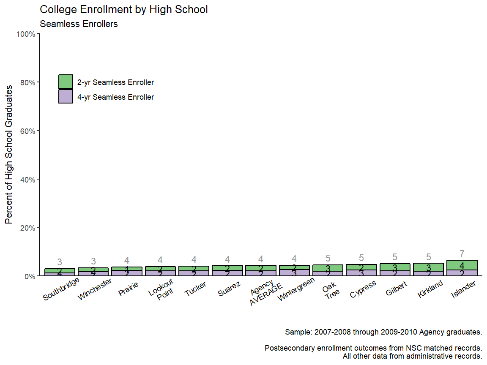
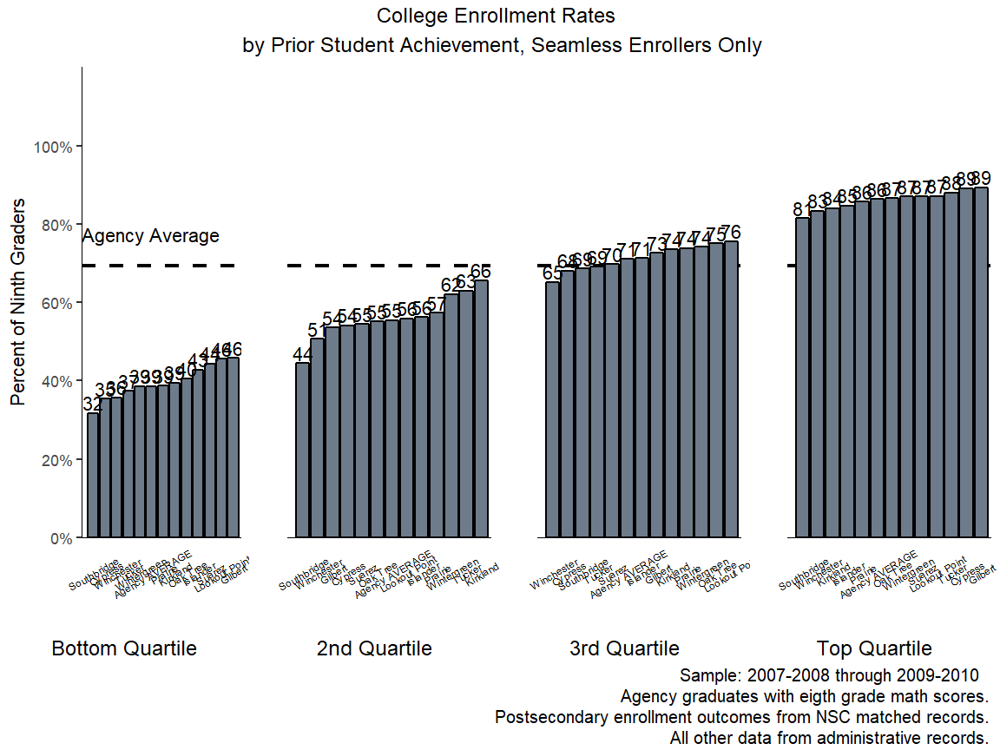
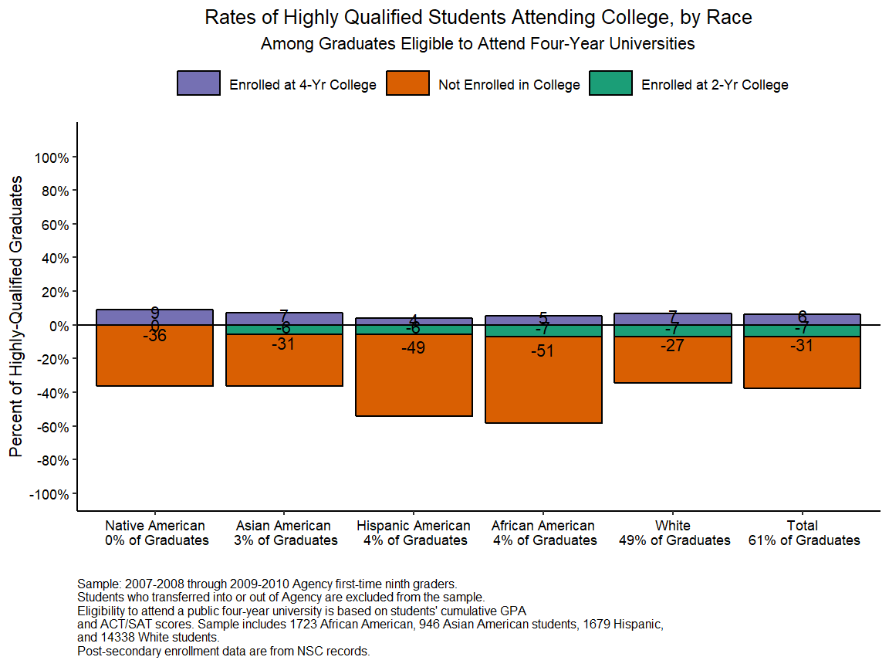
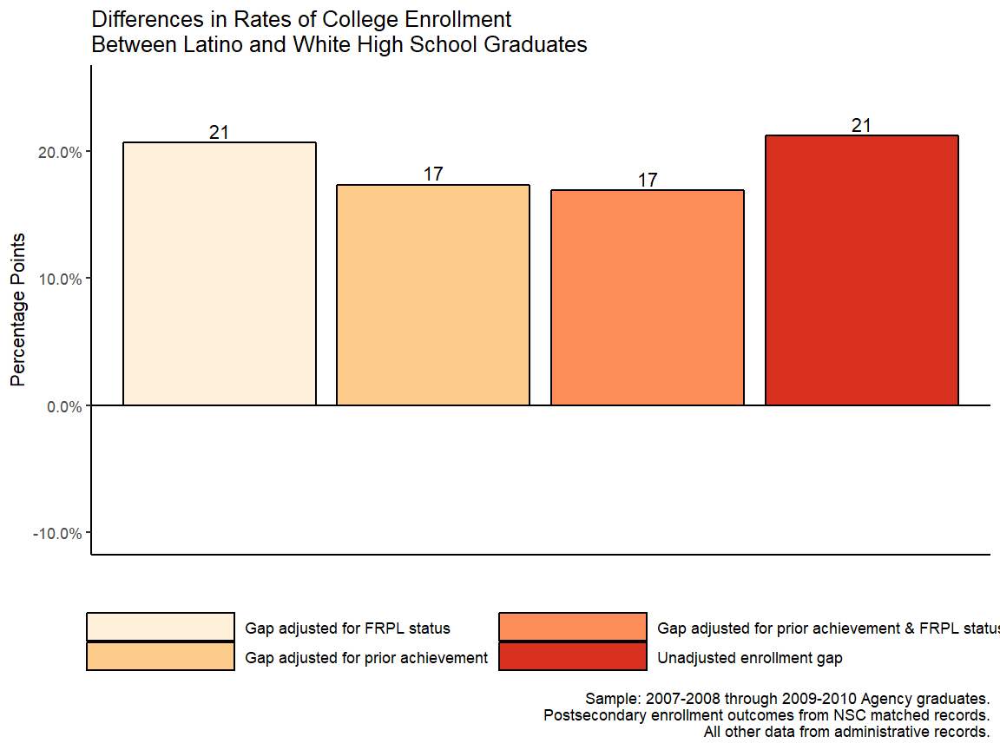
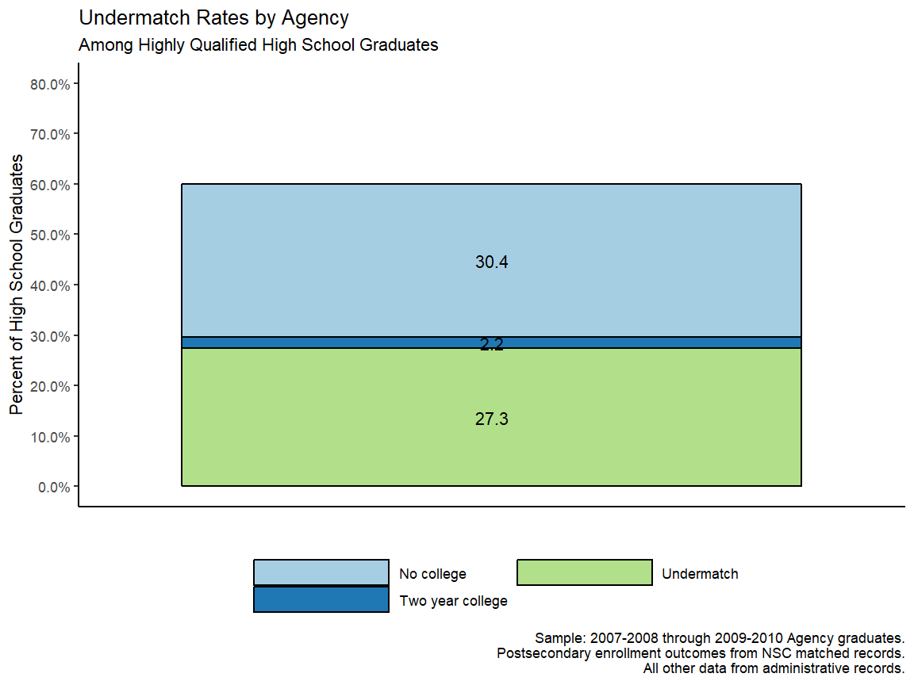

# College Enrollment

## Getting Started


<div class="navbar navbar-default navbar-fixed-top" id="logo">
<div class="container">

</div>
</div>

### Objective
 
In this guide you will be able to visualize college enrollment rates
by high school, college type, student achievement level before high school, student
race/ethnicity, and combinations of these factors. You will also be able to visualize the
share of highly qualified students who enroll in selective colleges.

### Using this Guide

The College-Going Pathways series is a set of guides, code, and sample data about
policy-relevant college-going topics. Browse this and other guides in the series for 
ideas about ways to investigate student pathways through high school and 
college. Each guide includes several analyses in the form of charts together with Stata 
analysis and graphing code to generate each chart.

Once you’ve identified analyses that you want to try to replicate or modify, click the 
"Download" buttons to download Stata code and sample data. You can make changes to the 
charts using the code and sample data, or modify the code to work with your own data. If 
you're familiar with Github, you can click “Go to Repository” and clone the entire 
College-Going Pathways repository to your own computer. Go to the Participate page to read 
about more ways to engage with the OpenSDP community.

### About the Data

The data visualizations in the College-Going Pathways series use a synthetically 
generated college-going analysis sample data file which has one record per student. Each 
high school student is assigned to a ninth-grade cohort, and each student record includes 
demographic and program participation information, annual GPA and on-track status, high 
school graduation outcomes, and college enrollment information. The Connect guide (coming 
soon) will provide guidance and example code which will help you build a college-going 
analysis file using data from your own school system.

#### Loading the OpenSDP Dataset

This guide takes advantage of the OpenSDP synthetic dataset. 


```r
library(tidyverse) # main suite of R packages to ease data analysis
library(magrittr) # allows for some easier pipelines of data
library(tidyr) #
library(ggplot2) # to plot
library(scales) # to format
library(grid)
library(gridExtra) # to plot
# Read in some R functions that are convenience wrappers
source("../R/functions.R") # R program is a directory above the docs directory
pkgTest("devtools")
pkgTest("OpenSDPsynthR")
```


### About the Analyses

Given the substantial economic and social benefits of a college degree, 
understanding a high schools’ role in preparing students to persist through 
college is essential. This section provides a series of analyses that highlight
college-going rates across high schools in your agency. You will consider 
whether high school graduates enroll in colleges and universities well-aligned 
to their  incoming academic qualifications. This is one factor that may increase 
a students’ likelihood of college persistence and degree attainment.

### Sample Restrictions

One of the most important decisions in running each analysis is 
defining the sample. Each analysis corresponds to a different part of the education 
pipeline and as a result requires different cohorts of students.

If you are using the synthetic data we have provided, the sample restrictions have been 
predefined and are included below. If you run this code using your own agency data, 
change the sample restrictions based on your data. Note that you will have to run these 
sample restrictions at the beginning of your do file so they will feed into the rest of 
your code.


```r
# Read in global variables for sample restriction
# Agency name
agency_name <- "Agency"

# Ninth grade cohorts you can observe persisting to the second year of college
chrt_ninth_begin_persist_yr2 = 2004
chrt_ninth_end_persist_yr2 = 2006

# Ninth grade cohorts you can observe graduating high school on time
chrt_ninth_begin_grad = 2004
chrt_ninth_end_grad = 2006

# Ninth grade cohorts you can observe graduating high school one year late
chrt_ninth_begin_grad_late = 2004
chrt_ninth_end_grad_late = 2006

# High school graduation cohorts you can observe enrolling in college the fall after graduation
chrt_grad_begin = 2008
chrt_grad_end = 2010

# High school graduation cohorts you can observe enrolling in college two years after hs graduation
chrt_grad_begin_delayed = 2008
chrt_grad_end_delayed = 2010

# In RStudio these variables will appear in the Environment pane under "Values"
```

Based on the sample data, you will have three cohorts (sometimes only 
two) for analysis. If you are using your own agency data, you may decide 
to aggregate results for more or fewer cohorts to report your results. This 
decision depends on 1) how much historical data you have available and 
2) what balance to strike between reliability and averaging
away information on recent trends. We suggest you average results for the last 
three cohorts to take advantage of larger sample sizes and improve reliability. 
However, if you have data for more than three cohorts, you may decide to not 
average data out for fear of losing information about trends and recent changes 
in your agency.

### Giving Feedback on this Guide
 
This guide is an open-source document hosted on Github and generated using the Stata
Webdoc package. We welcome feedback, corrections, additions, and updates. Please
visit the OpenSDP college-going pathways repository to read our contributor guidelines.

## Analyses

### College Enrollment Rates by High School

**Purpose:** This analysis provides an agency snapshot of college enrollment 
to understand how patterns of college going for high school graduates vary 
across high schools. By illuminating the extent to which enrollment varies by 
entry time for seamless enrollers and college level (2- vs. 4-year), the 
analysis helps diagnose compositional differences for the college-bound 
population by high school attended.

**Required Analysis File Variables:**

- `sid`
- `chrt_grad` 
- `enrl_1oct_grad_yr1_any`
- `enrl_1oct_grad_yr1_2yr`
- `enrl_1oct_grad_yr1_4yr`
- `enrl_ever_w2_grad_2yr`
- `enrl_ever_w2_grad_4yr`
- `hs_diploma`
- `last_hs_code`
- `last_hs_name`

**Analysis-Specific Sample Restrictions:**

- Keep students in high school graduation cohorts you can observe enrolling in 
college the fall after graduation.
- Drop any high schools with less than 20 students in the sample.
- Include only graduates who received regular or advanced diplomas (i.e. 
exclude students who received SPED diplomas and other certificates).

**Ask Yourself**
- How do college enrollment rates differ by high schools? Why might certain 
schools have a greater percentage of high school graduates enrolling in college? 
Do certain schools have higher percentages of 2-year or delayed college enrollers?

**Possible Next Steps or Action Plans:** Replicate this analysis to include 
all first-time ninth graders (i.e. ninth grade cohorts) in place of graduates.
Additionally, create individual high school reports that provide more details 
for school administrators (top enrolling institutions of the school’s graduates).

**Analytic Technique:** Calculate the proportion of students who enroll in college by high school.


```r
# // Step 2: Keep students in high school graduation cohorts you can observe 
# enrolling in college the fall after graduation
plotdf <- cgdata %>% filter(chrt_grad >= chrt_grad_begin & 
                              chrt_grad <= chrt_grad_end)
```


```r
# // Step 3: Obtain the agency-level and school averages for seamless enrollment

chartData <- 
  bind_rows(plotdf %>% select(last_hs_name, enrl_1oct_grad_yr1_2yr,
                              enrl_1oct_grad_yr1_4yr, hs_diploma) %>%
              group_by(last_hs_name) %>% 
              summarize_all(funs(sum), na.rm=TRUE),
  plotdf %>% select(enrl_1oct_grad_yr1_2yr, enrl_1oct_grad_yr1_4yr, 
                               hs_diploma) %>% 
    summarize_all(funs(sum), na.rm=TRUE) %>% 
    mutate(last_hs_name = "Agency AVERAGE")
  )

# // Step 4: Reshape agency data for plotting
chartData <- chartData %>% gather(key = outcome, 
                             value = measure, -last_hs_name, -hs_diploma)

# // Step 5: Calculate rates
chartData %<>% group_by(last_hs_name) %>% 
  mutate(enroll_any = sum(measure) / hs_diploma[1]) %>% 
  ungroup

# // Step 6: Recode variables
chartData$last_hs_name <- gsub("High School", "", chartData$last_hs_name)
# Split levels
chartData$last_hs_name <- gsub(" ", "\n", chartData$last_hs_name)
chartData$outcome[chartData$outcome == "enrl_1oct_grad_yr1_2yr"] <- 
  "2-yr Seamless Enroller"
chartData$outcome[chartData$outcome == "enrl_1oct_grad_yr1_4yr"] <- 
  "4-yr Seamless Enroller"
```


```r
# Make the figure caption
figureCaption <- paste0("Sample: ", chrt_grad_begin -1, "-", chrt_grad_begin, 
                        " through ", chrt_grad_end -1, "-", chrt_grad_end, 
                        " ", agency_name, " graduates.\n", 
                        "\n Postsecondary enrollment outcomes from NSC matched records.", 
                        "\n All other data from administrative records.")

ggplot(chartData, aes(x = reorder(last_hs_name, enroll_any), 
                      y = measure/hs_diploma, 
                      fill = outcome, group = outcome)) + 
  geom_bar(stat = "identity", position = "stack", color = I("black")) + 
  geom_text(aes(label = round(100 * measure/hs_diploma)), 
            position = position_stack(vjust = 0.5)) +
  geom_text(aes(label = round(100 * enroll_any), y = enroll_any), 
            vjust = -0.5, color = I("gray60")) +
  theme_classic() + 
  scale_y_continuous(limits = c(0, 1), breaks = seq(0, 1, 0.2), 
                     expand = c(0,0),
                     label = percent) + 
  scale_fill_brewer(name = "", type = "qual", palette = 1) +
  labs(x = "", y = "Percent of High School Graduates", 
       title = "College Enrollment by High School", 
       subtitle = "Seamless Enrollers", 
       caption = figureCaption) + 
  theme(axis.text.x = element_text(angle = 30, vjust = 0.8, color = "black"), 
        legend.position = c(0.15, 0.8), axis.ticks.x = element_blank())
```



### Seamless and Delayed College Enrollment Rates by High School

**Purpose:** This analysis provides an agency snapshot of college enrollment 
to understand how patterns of college going for high school graduates vary 
across high schools. By illuminating the extent to which enrollment varies by 
entry time (seamless vs. delayed) and college level (2- vs. 4-year), the 
analysis helps diagnose compositional differences for the college-bound 
population by high school attended.


**Required Analysis File Variables:**

- `sid`
- `chrt_grad` 
- `enrl_1oct_grad_yr1_any`
- `enrl_1oct_grad_yr1_2yr`
- `enrl_1oct_grad_yr1_4yr`
- `enrl_ever_w2_grad_2yr`
- `enrl_ever_w2_grad_4yr`
- `hs_diploma`
- `last_hs_code`
- `last_hs_name`

**Analysis-Specific Sample Restrictions:**

- Keep students in high school graduation cohorts you can
observe enrolling in college the fall after graduation.
- Drop any high schools with less than 20 students in the
sample.
- Include only graduates who received regular or advanced
diplomas (i.e. exclude students who received SPED diplomas
and other certificates).

**Ask Yourself**

- How do college enrollment rates differ by high schools? Why might certain 
schools have a greater percentage of high school graduates enrolling in 
college? Do certain schools have higher percentages of 2-year or delayed 
college enrollers?

**Possible Next Steps or Action Plans:** Replicate this analysis to include 
all first-time ninth graders (i.e. ninth grade cohorts) in place of graduates.
Additionally, create individual high school reports that provide more details 
for school administrators (top enrolling institutions of the school’s graduates).

**Analytic Technique:** Calculate the proportion of graduates who enroll in 
four-year institutions across high schools according to the selectivity ranking 
of the postsecondary institutions attended.


```r
# // Step 1: Keep students in high school graduation cohorts you can observe 
# enrolling in college the fall after graduation

plotdf <- cgdata %>% filter(chrt_grad >= chrt_grad_begin & 
                              chrt_grad <= chrt_grad_end) %>% 
  select(sid, chrt_grad, enrl_1oct_grad_yr1_2yr, enrl_1oct_grad_yr1_4yr,
         enrl_1oct_grad_yr1_any, enrl_ever_w2_grad_2yr, enrl_ever_w2_grad_any,
         enrl_ever_w2_grad_4yr, hs_diploma, last_hs_code, last_hs_name)
```


```r
# // Step 2: Create binary outcomes for late enrollers
plotdf$late_any <- ifelse(plotdf$enrl_1oct_grad_yr1_any == 0 & 
                            plotdf$enrl_ever_w2_grad_any == 1, 1, 0)
plotdf$late_4yr <- ifelse(plotdf$enrl_1oct_grad_yr1_any == 0 & 
                            plotdf$enrl_ever_w2_grad_4yr == 1, 1, 0)
plotdf$late_2yr <- ifelse(plotdf$enrl_1oct_grad_yr1_any == 0 & 
                            plotdf$enrl_ever_w2_grad_2yr == 1, 1, 0)

# // Step 3: Obtain the agency and school average for seamless and 
# delayed enrollment

chartData <-  bind_rows(
  plotdf %>% select(last_hs_name, enrl_1oct_grad_yr1_2yr, 
                              enrl_1oct_grad_yr1_4yr, late_4yr, late_2yr,
                              hs_diploma) %>%
              group_by(last_hs_name) %>% 
              summarize_all(funs(sum), na.rm=TRUE),
  plotdf %>% select(enrl_1oct_grad_yr1_2yr, 
                              enrl_1oct_grad_yr1_4yr, late_4yr, late_2yr,
                              hs_diploma) %>% 
    summarize_all(funs(sum), na.rm=TRUE) %>% 
    mutate(last_hs_name = "Agency AVERAGE")
  )

# // Step 4: Reshape for plotting

chartData <- chartData %>% gather(key = outcome, 
                             value = measure, -last_hs_name, -hs_diploma)

# // Step 5: Generate percentages of high school grads attending college. 

chartData %<>% group_by(last_hs_name) %>% 
  mutate(enroll_any = sum(measure) / hs_diploma[1]) %>% 
  ungroup

# // Step 6: Recode values for plotting
chartData$last_hs_name <- gsub("High School", "", chartData$last_hs_name)
chartData$last_hs_name <- gsub(" ", "\n", chartData$last_hs_name)
chartData$outcome[chartData$outcome == "enrl_1oct_grad_yr1_2yr"] <- "2-yr Seamless"
chartData$outcome[chartData$outcome == "enrl_1oct_grad_yr1_4yr"] <- "4-yr Seamless"
chartData$outcome[chartData$outcome == "late_2yr"] <- "2-yr Delayed"
chartData$outcome[chartData$outcome == "late_4yr"] <- "4-yr Delayed"
```


```r
# // Step 7: Plot
ggplot(chartData, aes(x = reorder(last_hs_name, enroll_any), 
                      y = measure/hs_diploma, 
                      fill = outcome, group = outcome)) + 
  geom_bar(stat = "identity", position = "stack", color = I("black")) + 
  geom_text(aes(label = round(100 * measure/hs_diploma)), 
            position = position_stack(vjust = 0.5)) +
  geom_text(aes(label = round(100 * enroll_any), y = enroll_any), 
            vjust = -0.5, color = I("gray60")) +
  theme_classic() + 
  scale_y_continuous(limits = c(0, 1), breaks = seq(0, 1, 0.2), 
                     expand = c(0,0),
                     label = percent) + 
  scale_fill_brewer(name = "", type = "seq", palette = "YlGnBu") +
  labs(x = "", y = "Percent of High School Graduates", 
       title = "College Enrollment by High School", 
       subtitle = "Seamless and Delayed Enrollers", 
       caption = figureCaption) + 
  theme(axis.text.x = element_text(angle = 30, vjust = 0.8, color = "black"), 
        legend.position = c(0.1, 0.8), axis.ticks.x = element_blank())
```


### College Enrollment Rates by Average 8th Grade Achievement

**Purpose:** This analysis displays variations in college enrollment rates across 
high schools by examining the extent to which academic achievement at high 
school entry explains variation in college going across high schools. This 
analysis is useful to identify high schools with similar incoming student 
achievement profiles but divergent college enrollment rates; or on the other 
hand, high schools with similar college-going rates but different academic 
performance at high school entry. 

**Required Analysis File Variables:**

- `sid`
- `chrt_grad` 
- `enrl_1oct_grad_yr1_any`
- `test_math_8_std`
- `last_hs_code`
- `last_hs_name`

**Analysis-Specific Sample Restrictions:**

- Keep students in high school graduation cohorts you can observe enrolling in 
college the fall after graduation AND have non-missing eighth grade test scores.
- Include only graduates who received regular or advanced diplomas (i.e. 
exclude students who received SPED diplomas and other certificates).

**Ask Yourself**
- What might explain variation in college enrollment rates for high schools 
with similar incoming achievement? What might explain variation in incoming 
achievement for high schools with similar college enrollment rates?

**Possible Next Steps or Action Plans:** Repeat this analysis to include all 
first-time ninth graders (i.e. ninth grade cohorts) in place of graduates, 
and explore college enrollment within two years of high school completion. 
Additionally, replicate this analysis to explore the relationship between 
college enrollment and students’ ELA achievement at high school entry. Consider 
why schools with similar incoming student profiles may report dramatically 
different college-going rates. Conversely, consider why schools with dissimilar 
student bodies report similar matriculation rates to college.

**Analytic Technique:** Bivariate scatterplot of school-level average student 
test scores and college enrollment rates.


```r
# // Step 2: Keep students in high school graduation cohorts you can observe 
# enrolling in college the fall after graduation AND have non-missing eighth 
# grade math scores

plotdf <- cgdata %>% filter(chrt_grad >= chrt_grad_begin & 
                              chrt_grad <= chrt_grad_end) %>% 
  select(sid, chrt_grad, enrl_1oct_grad_yr1_any, test_math_8_std,
         last_hs_name) %>% 
  filter(!is.na(test_math_8_std))
```


```r
# // Step 2: Obtain agency-level college enrollment rate and prior 
# achievement score for dotted lines. Also get position of their labels

AGENCYLEVEL <- plotdf %>% 
  summarize(agency_mean_enroll = mean(enrl_1oct_grad_yr1_any, na.rm=TRUE), 
            agency_mean_test = mean(test_math_8_std)) %>% 
  as.data.frame

# // Step 3: Obtain school-level college enrollment rates and prior 
# achievement scores
chartData <- plotdf %>% group_by(last_hs_name) %>% 
  summarize(math_test = mean(test_math_8_std), 
            enroll_rate = mean(enrl_1oct_grad_yr1_any, na.rm=TRUE), 
            count = n())
# // Step 4: Shorten HS name for plotting
chartData$last_hs_name <- gsub("High School", "", chartData$last_hs_name)
chartData$last_hs_name <- gsub(" ", "\n", chartData$last_hs_name)
```


```r
# // Step 5: Plot
ggplot(chartData, aes(x = math_test, y = enroll_rate)) + 
  geom_point() + geom_text(aes(label = last_hs_name), 
                           nudge_x = -0.02, nudge_y= 0.02, angle = 30,
                           check_overlap = FALSE) +
  theme_classic() + 
  geom_hline(yintercept = AGENCYLEVEL$agency_mean_enroll, linetype = 2, 
             size = I(1.1), color = I("slateblue")) +
  geom_vline(xintercept = AGENCYLEVEL$agency_mean_test, linetype = 2, 
             size = I(1.1), color = I("goldenrod")) +
  scale_y_continuous(limits = c(0,1), breaks = seq(0, 1, 0.2), label = percent) + 
  scale_x_continuous(limits = c(-0.8, 1), breaks = seq(-0.8, 1, 0.2)) + 
  annotate(geom = "text", x = -.675, y = 0.025, 
           label = "Below average math scores & \n below average college enrollment", 
           size = I(2.5)) +
  annotate(geom = "text", x = .88, y = 0.025, 
           label = "Above average math scores & \n below average college enrollment", 
           size = I(2.5)) +
  annotate(geom = "text", x = .88, y = 0.975, 
           label = "Above average math scores & \n above average college enrollment", 
           size = I(2.5)) +
  annotate(geom = "text", x = -.675, y = 0.975, 
           label = "Below average math scores & \n above average college enrollment", 
           size = I(2.5)) + 
  annotate(geom = "text", x = .255, y = 0.125, 
           label = "Agency Average \n Test Score", 
           size = I(2.5), color = I("goldenrod")) + 
  annotate(geom = "text", x = -.675, y = 0.71, 
           label = "Agency Average \nCollege Enrollment Rate", 
           size = I(2.5)) + 
  labs(x = "Percent of High School Graduates", 
       y = "Average 8th Grade Math Standardized Score", 
       title = "College Enrollment Rates by Prior Student Achievement",
       subtitle = "Seamless Enrollers", 
       caption = figureCaption) + 
  theme(axis.text = element_text(color="black", size = 12))
```


### College Enrollment Rates by 8th Grade Achievement Quartiles

**Purpose:** This analysis explores whether variation in college enrollment 
across high schools is similar among low-, middle, and top-achieving students. 
It also considers whether overall variation across schools derives from 
concentrated divergence among students scoring in a particular achievement 
range. Additionally, the analysis facilitates granular school-to-school 
comparisons to identify those especially under-, or over-performing within 
each achievement quartile. Finally, the analysis also helps identify which 
student subgroups require additional resources and support within each school. 


**Required Analysis File Variables:**

- `sid`
- `chrt_grad` 
- `enrl_1oct_grad_yr1_any`
- `qrt_8_math_std`
- `last_hs_code`
- `last_hs_name`

**Analysis-Specific Sample Restrictions:**

- Keep students in high school graduation cohorts you can observe enrolling in 
college the fall after graduation AND have non-missing eighth grade test scores.
- Drop high schools with less than 20 students in each quartile enrolled in 
ninth grade across the cohorts. 
- Keep only graduates who received regular or advanced diplomas (i.e. exclude 
students who received SPED diplomas and other certificates).

**Ask Yourself**

- After looking at the average in each quartile (the orange bars), how do 8th 
grade test scores relate to college enrollment? Within each quartile of 8th 
grade test scores (the blue bars), how do enrollment rates vary by high school? 
What is the difference between top and bottom performing high schools in each 
quartile?

**Possible Next Steps or Action Plans:** Repeat this analysis to include all 
first-time ninth graders (i.e. ninth grade cohorts) in place of graduates, and 
explore college enrollment within two years of high school completion. 
Additionally, replicate this analysis to explore the relationship between 
college enrollment and students’ ELA achievement at high school entry. Consider 
why schools with similar incoming student profiles may report dramatically 
different college-going rates. Conversely, consider why schools with distinct 
student bodies may report similar matriculation rates to college.

**Analytic Technique:** Calculate the proportion of graduates who enrolled in 
college by October 1st following their high school graduation year by high 
school and 8th grade test score quartile.


```r
# // Step 1: Keep students in high school graduation cohorts you can observe 
# enrolling in college the fall after graduation AND have non-missing eighth 
# grade math scores

plotdf <- cgdata %>% filter(chrt_grad >= chrt_grad_begin & 
                              chrt_grad <= chrt_grad_end) %>% 
  select(sid, chrt_grad, enrl_1oct_grad_yr1_any, qrt_8_math,
         last_hs_name) %>% 
  filter(!is.na(qrt_8_math))
```


```r
# // Step 2: Obtain the overall agency-level high school graduation rate for 
# dotted line along with the position of its label
AGENCYLEVEL <- plotdf %>% 
  summarize(agency_mean_enroll = mean(enrl_1oct_grad_yr1_any, na.rm=TRUE)) %>% 
  as.data.frame

# // Step 5: Obtain school-level and agency level college enrollment rates by 
# test score quartile and append the agency-level enrollment rates 
# by quartile
chartData <- bind_rows(
  plotdf %>% group_by(last_hs_name, qrt_8_math) %>% 
  summarize(enroll_rate = mean(enrl_1oct_grad_yr1_any, na.rm=TRUE), 
            count = n()),
  plotdf %>% group_by(qrt_8_math) %>% 
  summarize(enroll_rate = mean(enrl_1oct_grad_yr1_any, na.rm=TRUE), 
            count = n(), 
            last_hs_name = "Agency AVERAGE")
)

# // Step 6: Recode HS Name for plotting
chartData$last_hs_name <- gsub("High School", "", chartData$last_hs_name)
# chartData$last_hs_name <- gsub(" ", "\n", chartData$last_hs_name)

# Make the figure caption
figureCaption <- paste0("Sample: ", chrt_grad_begin -1, "-", chrt_grad_begin, 
                        " through ", chrt_grad_end -1, "-", chrt_grad_end, 
                        "  \n", agency_name, " graduates with eigth grade math scores.", 
                        "\nPostsecondary enrollment outcomes from NSC matched records.", 
                        "\n All other data from administrative records.")
```


```r
# // Step 7: Make plot for first panel with legend and labels

p1 <- ggplot(chartData[chartData$qrt_8_math == 1, ], 
       aes(x = reorder(last_hs_name, enroll_rate), y = enroll_rate)) + 
        geom_hline(yintercept = as.numeric(AGENCYLEVEL$agency_mean_enroll),
               linetype = 2, size = I(1.1)) +
  geom_bar(stat = "identity", fill = "lightsteelblue4", color = I("black")) + 
    scale_y_continuous(limits = c(0, 1.2), breaks = seq(0, 1, 0.2), 
                       expand = c(0, 0), label = percent) + 
    theme_bw() + 
  annotate(geom = "text", x = 6, y = 0.775, label = "Agency Average") +
    theme(panel.grid = element_blank(),
                       axis.text.x = element_text(angle = 30, size=6,
                                                  color = "black", vjust = 0.5),
          axis.line.y = element_line(),  axis.line.x = element_line(),
          axis.ticks.x = element_blank(),panel.border = element_blank()) +
    labs(y = "Percent of Ninth Graders", x = "") + 
    geom_text(aes(label = round(enroll_rate * 100, 0)), vjust = -0.2) +
    expand_limits(y = 0, x = 0)

# // Step 8 : Make Template for following 3 panels with fewer legends and 
# labels

p2 <-  ggplot(chartData[chartData$qrt_8_math == 2, ], 
       aes(x = reorder(last_hs_name, enroll_rate), y = enroll_rate)) +
      geom_hline(yintercept = as.numeric(AGENCYLEVEL$agency_mean_enroll),
               linetype = 2, size = I(1.1)) +
  geom_bar(stat = "identity", fill = "lightsteelblue4", color = I("black")) + 
    scale_y_continuous(limits = c(0,1.2), breaks = seq(0, 1, 0.2), 
                       expand = c(0, 0), label = percent) + 
    theme_bw() + 
    theme(panel.grid = element_blank(),
                       axis.text.x = element_text(angle = 30, size=6,
                                                  color = "black", vjust = 0.5),
          axis.ticks = element_blank(), axis.line.x = element_line(),
          axis.text.y = element_blank(), axis.line.y = element_blank(), 
          panel.border = element_blank()) +
    labs(y = "", x = "") + 
    geom_text(aes(label = round(enroll_rate * 100, 0)), vjust = -0.2) +
    expand_limits(y = 0, x = 0)

# // Step 9: Combine first plot with template applied to quartiles 2, 3, and 4
# Use %+% operator to replace the data in the plot template with another data
# set
grobList <- list(
  p1,
  p2, 
  p2 %+% chartData[chartData$qrt_8_math == 3, ],
  p2 %+% chartData[chartData$qrt_8_math == 4, ]
)

# // Step 10: Apply quartile labels to each panel
wrap <- mapply(arrangeGrob, grobList, 
               bottom = c("Bottom Quartile", "2nd Quartile", 
                          "3rd Quartile", "Top Quartile"), 
               SIMPLIFY=FALSE)

# // Step 11: Plot with labels
grid.arrange(grobs=wrap, nrow=1, 
             top = paste0("College Enrollment Rates ", 
                          "\n by Prior Student Achievement, Seamless Enrollers Only"), 
             bottom = textGrob(label = figureCaption, 
             gp=gpar(fontsize=10,lineheight=1), just = 1, 
               x = unit(0.99, "npc")))
```



### Rates of College Enrollment by College Type Among Highly Qualified Graduates

**Purpose:** Research consistently finds wide variation in rates of persistence 
and completion across postsecondary institutions. This analysis examines 
whether high school graduates enroll in colleges and universities that provide 
the right academic fit to maximize their chances of completion. "Match"describes 
the extent high school graduates with strong academic records attend colleges
and universities that allow them to take advantage of their ambition and 
abilities. While "matching" to an appropriately selective college is only one 
factor to consider when choosing a postsecondary institution, the implications 
of under-matching (i.e. lower rates of persistence and degree completion) 
suggest students should be encouraged to attend realistic, yet challenging 
postsecondary institutions. 

**Required Analysis File Variables:**

- `sid`
- `race_ethnicity`
- `chrt_grad` 
- `highly_qualified`
- `enrl_1oct_grad_yr1_any`
- `enrl_1oct_grad_yr1_4yr`
- `enrl_1oct_grad_yr1_2yr`

**Analysis-Specific Sample Restrictions:**

- Keep students in high school graduation cohorts you can
observe enrolling in college the fall after graduation.
- Include only graduates who received regular or advanced
diplomas (i.e. exclude students who received SPED diplomas
and other certificates).
- Include only highly qualified high school graduates (i.e.
students who have obtained a high school diploma on time
with 1) a cumulative GPA of 3.0 or higher and Math/Verbal
SAT score of 1300 or higher, or 2) a cumulative GPA of 3.3 or
higher and Math/Verbal SAT score of 1200 or higher, or 3) a
cumulative GPA of 3.7 or higher and Math/Verbal SAT score
of at least 1100).
- Drop race/ethnic groups with less than 20 students eligible
to attend a four-year university.

**Ask Yourself**

- Among highly qualified students, which race/ethnicities seem to face the 
greatest undermatch rates?

**Possible Next Steps or Action Plans:** This analysis leads to important 
questions that warrant further exploration. What factors drive undermatch 
differences across student subgroups and high schools? To what extent is 
undermatching concentrated among first-time college-goers? To what extent is
undermatching driven by students’ proximity to 2-year versus 4-year 
institutions? What college aspirations do incoming ninth graders hold, and do 
these aspirations change by the time they enter or complete 12th grade? To 
what extent are teachers, counselors, and administrators supported to work with
students to cultivate postsecondary aspirations and weigh factors in the college
selection process?

**Analytic Technique:** Calculate the proportion of highly qualified graduates 
who do not enroll in college, enroll in 2-year college, and enroll in least 
competitive and unranked 4-year colleges the fall following high school 
graduation.


```r
# // Step 1: Keep students in high school graduation cohorts you can observe 
# enrolling in college the fall after graduation

plotdf <- cgdata %>% filter(chrt_grad >= chrt_grad_begin & 
                              chrt_grad <= chrt_grad_end) %>% 
  select(sid, chrt_grad, race_ethnicity, highly_qualified, 
         enrl_1oct_grad_yr1_any, enrl_1oct_grad_yr1_4yr, enrl_1oct_grad_yr1_2yr)

# Use race_ethnicity as a labeled factor for plotting
plotdf$race_ethnicity <- as.character(plotdf$race_ethnicity)
# // Step 2: Take total of all students in sample
totalCount <- nrow(plotdf)
```


```r
# // Step 3: Create "undermatch" outcomes
plotdf$no_college <- ifelse(plotdf$enrl_1oct_grad_yr1_any == 0, 1, 0)
plotdf$enrl_2yr <- ifelse(plotdf$enrl_1oct_grad_yr1_2yr == 1, 1, 0)
plotdf$enrl_4yr <- ifelse(plotdf$enrl_1oct_grad_yr1_4yr == 1, 1, 0)

# // Step 3: Create agency-level outcomes for total undermatching rates
agencyLevel <- plotdf %>% filter(highly_qualified == 1) %>% 
  summarize(no_college = mean(no_college, na.rm=TRUE), 
            enrl_2yr = mean(enrl_2yr, na.rm=TRUE), 
            enrl_4yr = mean(enrl_4yr, na.rm=TRUE), 
            total_count = n(), 
            race_ethnicity = "TOTAL")

# // Step 4: Create race/ethnicity-level outcomes for undermatching rates by 
# race/ethnicity
chartData <- plotdf %>% filter(highly_qualified == 1) %>% 
  group_by(race_ethnicity) %>%
  summarize(no_college = mean(no_college, na.rm=TRUE), 
            enrl_2yr = mean(enrl_2yr, na.rm=TRUE), 
            enrl_4yr = mean(enrl_4yr, na.rm=TRUE), 
            total_count = n())

chartData <- bind_rows(chartData, agencyLevel)

# // Step 5: Convert negative outcomes to negative values and reshape 
# data for plotting
chartData$no_college <- -chartData$no_college
chartData$enrl_2yr <- -chartData$enrl_2yr
chartData <- chartData %>% gather(key = outcome, value = measure, 
                                  -race_ethnicity, -total_count)

# // Step 7: Convert to percentages and relabel ethnicities for plot labels
chartData$groupPer <- round(100 * chartData$total_count/totalCount)
chartData$race_ethnicity[chartData$race_ethnicity == "Black"] <- "African American"
chartData$race_ethnicity[chartData$race_ethnicity == "Asian"] <- "Asian American"
chartData$race_ethnicity[chartData$race_ethnicity == "Hispanic"] <- "Hispanic American"
chartData$race_ethnicity[chartData$race_ethnicity == "TOTAL"] <- "Total"

chartData$label <- paste0(chartData$race_ethnicity, "\n ", 
                          chartData$groupPer, "% of Graduates")

chartData %<>% filter(chartData$race_ethnicity != "Multiple/Other")

# // Step 8: Create a label variable to label the outcomes on the plot
chartData$outcomeLabel <- NA
chartData$outcomeLabel[chartData$outcome == "no_college"] <- "Not Enrolled in College"
chartData$outcomeLabel[chartData$outcome == "enrl_2yr"] <- "Enrolled at 2-Yr College"
chartData$outcomeLabel[chartData$outcome == "enrl_4yr"] <- "Enrolled at 4-Yr College"

# // Step 9: Order the factor to plot in the correct order
chartData$outcomeLabel <- factor(chartData$outcomeLabel, 
                                 ordered = TRUE, 
                                 levels = c("Enrolled at 4-Yr College", 
                                            "Not Enrolled in College", 
                                            "Enrolled at 2-Yr College"))
```


```r
#// Step 10: Create a caption to put under the figure
n_aa <- nrow(plotdf[plotdf$race_ethnicity == "Black",])
n_a <- nrow(plotdf[plotdf$race_ethnicity == "Asian",])
n_h <- nrow(plotdf[plotdf$race_ethnicity == "Hispanic",])
n_w <- nrow(plotdf[plotdf$race_ethnicity == "White",])

figureCaption <- paste0("Sample: ", chrt_grad_begin -1, "-", chrt_grad_begin, 
                        " through ", chrt_grad_end -1, "-", chrt_grad_end, 
                        " ", agency_name, " first-time ninth graders.\n", 
                        "Students who transferred into or out of ", agency_name, 
                        " are excluded from the sample. \nEligibility to attend a public ",
                        "four-year university is based on students' cumulative GPA \n", 
                        "and ACT/SAT scores. Sample includes ", n_aa, " African American, ",
                        n_a, " Asian American students, ", n_h, " Hispanic, \n", 
                        "and ", n_w, " White students.", 
                        "\nPost-secondary enrollment data are from NSC records.")
# // Step 11: Plot

ggplot(chartData, aes(x = reorder(label, total_count), y = measure, 
                      group = outcomeLabel, 
                      fill = outcomeLabel)) + 
  geom_bar(position = 'stack', stat = 'identity', color = I("black")) + 
  geom_hline(yintercept = 0) + 
  geom_text(aes(label = round(measure * 100, 0)), 
            position=position_stack(vjust = 0.85)) +
  scale_y_continuous(limits = c(-1, 1.1), breaks = seq(-1, 1, 0.2), 
                     label = percent) +
  theme_classic() + 
  guides(fill = guide_legend(nrow=1, title = "", keywidth = 2)) +
  scale_fill_brewer(type = "qual", palette = 2, direction = -1) + 
  theme(legend.position = "top", axis.text = element_text(color = "black"), 
        plot.caption = element_text(hjust = 0, size = 8), 
        plot.title = element_text(hjust = 0.5), 
        plot.subtitle = element_text(hjust = 0.5)) + 
  labs(x = "", y = "Percent of Highly-Qualified Graduates", 
       title = "Rates of Highly Qualified Students Attending College, by Race", 
       subtitle = "Among Graduates Eligible to Attend Four-Year Universities", 
       caption = figureCaption)
```



### Gaps in Rates of College Enrollment Between Latino and White Graduates

**Purpose:** This Strategic Performance Indicator explores gaps in college 
enrollment rates by ethnicity, before and after accounting for differences in 
prior academic achievement, socioeconomic status, and both of these background
characteristics. While the analysis evaluates separately the college enrollment 
gaps between Black and White students and between Latino and White students, 
it can be modified to focus on the gap between any two races or ethnicities.

**Required Analysis File Variables:**

- `sid`
- `chrt_grad` 
- `last_hs_code`
- `race_ethnicity`
- `test_math_8`
- `frpl_ever`
- `enrl_1oct_grad_yr1_any`

**Analysis-Specific Sample Restrictions:**

- Keep students in high school graduation cohorts you can observe enrolling in 
college the fall after graduation.
-  Keep only graduates who received regular or advanced diplomas (i.e. exclude 
students who received SPED diplomas and other certificates).
- Drop race/ethnic groups with less than 20 students eligible to attend a 
four-year university. You may further restrict the sample to only include 
students from the most representative racial/ethnic sub-groups in your agency.

**Ask Yourself**

- How do racial gaps in college enrollment change after prior achievement is 
accounted for? How do these gaps change after socioeconomic status is accounted 
for?
- Do these gaps still exist when you account for both prior achievement and
socioeconomic status? Do they reverse direction, suggesting that minority 
students enroll in college at higher rates when compared with White students with
similar background characteristics?
- Do you observe differences in the degree to which the White-Black gap and 
the White-Latino gap decline after accounting for prior achievement and 
socioeconomic status? If the adjusted gap between White and Latino students, 
for example, is still sizable, what additional barriers may be impeding access 
to college for Latino students? 

**Analytic Technique:** Calculate the difference between the proportion of Black 
(or Latino) high school graduates and the proportion of White high school 
graduates who enrolled in college—in raw terms and after accounting for 8th 
grade test scores, for eligibility for Free or Reduced Price Lunch (FRPL), 
and for both of these characteristics. 


```r
# // Step 1: Keep students in high school graduation cohorts you can observe 
# enrolling in college the fall after graduation AND have non-missing eighth 
# grade test scores AND non-missing FRPL status

plotdf <- cgdata %>% filter(chrt_grad >= chrt_grad_begin & 
                              chrt_grad <= chrt_grad_end) %>% 
  select(sid, chrt_grad, race_ethnicity, test_math_8, frpl_ever,
         enrl_1oct_grad_yr1_any, last_hs_code) %>% 
  filter(!is.na(frpl_ever) & !is.na(test_math_8)) %>% 
  filter(race_ethnicity %in% c("Black", "White", "Hispanic") & !is.na(race_ethnicity)) %>%
  filter(!is.na(enrl_1oct_grad_yr1_any))

# // Step 2: Recode variables and create cluster variable
plotdf$race_ethnicity <- as.factor(plotdf$race_ethnicity)
plotdf$race_ethnicity <- relevel(plotdf$race_ethnicity, ref = "White")
# // Step 3: Create a unique identifier for clustering standard errors 
# at the cohort/school level
plotdf$cluster_var <- paste(plotdf$chrt_grad, plotdf$last_hs_code, sep = "-")
```


```r
# Load the broom library to make working with model coefficients simple 
# and uniform
library(broom)

# // Step 4: Estimate the unadjusted and adjusted differences in college 
# enrollment between Latino and white students and between black and white 
# students 

# Estimate unadjusted enrollment gap
#  Fit the model
mod1 <- lm(enrl_1oct_grad_yr1_any ~ race_ethnicity, data = plotdf)
#  Extract the coefficients
betas_unadj <- tidy(mod1)
#  Get the clustered variance-covariance matrix
#  Use the get_CL_vcov function from the functions.R script
clusterSE <- get_CL_vcov(mod1, plotdf$cluster_var)
#  Get the clustered standard errors and combine with the betas
betas_unadj$std.error <- sqrt(diag(clusterSE))
betas_unadj <- betas_unadj[, 1:3]
#  Label
betas_unadj$model <- "Unadjusted enrollment gap"

# Estimate enrollment gap adjusting for prior achievement
mod2 <- lm(enrl_1oct_grad_yr1_any ~ race_ethnicity + test_math_8, data = plotdf)
betas_adj_prior_ach <- tidy(mod2)
clusterSE <- get_CL_vcov(mod2, plotdf$cluster_var)
betas_adj_prior_ach$std.error <- sqrt(diag(clusterSE))
betas_adj_prior_ach <- betas_adj_prior_ach[, 1:3]
betas_adj_prior_ach$model <- "Gap adjusted for prior achievement"

# Estimate enrollment gap adjusting for frpl status
plotdf$frpl_ever <- ifelse(plotdf$frpl_ever > 0, 1, 0)
mod3 <- lm(enrl_1oct_grad_yr1_any ~ race_ethnicity + frpl_ever, data = plotdf)
betas_adj_frpl <- tidy(mod3)
clusterSE <- get_CL_vcov(mod3, plotdf$cluster_var)
betas_adj_frpl$std.error <- sqrt(diag(clusterSE))
betas_adj_frpl <- betas_adj_frpl[, 1:3]
betas_adj_frpl$model <- "Gap adjusted for FRPL status"

# Estimate enrollment gap adjusting for prior achievement and frpl status
mod4 <- lm(enrl_1oct_grad_yr1_any ~ race_ethnicity + frpl_ever + test_math_8, 
           data = plotdf)
betas_adj_frpl_prior <- tidy(mod4)
clusterSE <- get_CL_vcov(mod4, plotdf$cluster_var)
betas_adj_frpl_prior$std.error <- sqrt(diag(clusterSE))
betas_adj_frpl_prior <- betas_adj_frpl_prior[, 1:3]
betas_adj_frpl_prior$model <- "Gap adjusted for prior achievement & FRPL status"

# // Step 5. Transform the regression coefficients to a data object for plotting
chartData <- bind_rows(betas_unadj, betas_adj_frpl, betas_adj_prior_ach, 
                    betas_adj_frpl_prior)
# Cleanup workspace
rm(plotdf, betas_unadj, betas_adj_frpl, betas_adj_frpl_prior, 
   betas_adj_prior_ach)
```


```r
# Make the figure caption
figureCaption <- paste0("Sample: ", chrt_grad_begin -1, "-", chrt_grad_begin, 
                        " through ", chrt_grad_end -1, "-", chrt_grad_end, 
                        " ", agency_name, " graduates.\n", 
                        "Postsecondary enrollment outcomes from NSC matched records.", 
                        "\n All other data from administrative records.")
# // Step 6. Plot
ggplot(chartData[chartData$term == "race_ethnicityHispanic", ],
       aes(x = model, y = -estimate, fill = model)) + 
  geom_bar(stat = 'identity', color = I("black")) + 
  scale_fill_brewer(type = "seq", palette = 8) +
  geom_hline(yintercept = 0) + 
  guides(fill = guide_legend("", keywidth = 6, nrow = 2)) + 
  geom_text(aes(label = round(100 * -estimate, 0)), vjust = -0.3) +
  scale_y_continuous(limits = c(-0.1, 0.25), breaks = seq(-0.1, 0.25, 0.1), 
                     label = percent, name = "Percentage Points") + 
  theme_classic() + theme(legend.position = "bottom", axis.text.x = element_blank(), 
                          axis.ticks.x = element_blank()) + 
  labs(title = paste0("Differences in Rates of College Enrollment", 
                      " \nBetween Latino and White High School Graduates"), 
       x = "",
       caption = figureCaption)
```



### College Enrollment Rates by 8th Grade Achievement Quartile Bubbles

**Purpose:** This SPI highlights the variation in college-going rates across high 
schools when students with similar prior achievement are compared. To conduct 
these comparisons, we first sort all incoming ninth-graders into quartiles 
based on their 8th grade test scores. We then examine college-going rates by 
high school among graduates within each of these quartiles.

**Required Analysis File Variables:**

- `sid`
- `chrt_grad` 
- `last_hs_name`
- `hs_diploma`
- `qrt_8_math_std`
- `enrl_1oct_grad_yr1_any`

**Analysis-Specific Sample Restrictions:**

- Keep students in high school graduation cohorts you can observe
enrolling in college the fall after graduation AND have
non-missing eighth grade test scores.
- Drop high schools with less than 20 students in each quartile
enrolled in ninth grade across the cohorts.
- Keep only graduates who received regular or advanced diplomas
(i.e. exclude students who received SPED diplomas
and other certificates).

**Ask Yourself**

- How do college enrollment rates vary across high schools for students within 
the same quartile of 8th grade test scores (that is, when we compare students 
with similar prior achievement)?
- What is the difference between the high schools with the lowest and with the 
highest rates in each quartile?
- Are across-school differences in colleges enrollment rates particularly large 
for students of certain achievement profile—for example, for students with 8th 
grade test scores in the bottom quartile? 

**Analytic Technique:** Calculate the share of students in each 8th grade test 
score quartile at each high school who enroll in college seamlessly after high 
school graduation.


```r
# // Step 1: Keep students in high school graduation cohorts you can observe 
# enrolling in college the fall after graduation AND have non-missing eighth 
# grade test scores
plotdf <- cgdata %>% filter(chrt_grad >= chrt_grad_begin & 
                              chrt_grad <= chrt_grad_end) %>% 
  select(sid, chrt_grad, qrt_8_math, hs_diploma,
         enrl_1oct_grad_yr1_any, last_hs_name) %>% 
  filter(!is.na(qrt_8_math)) %>% 
  filter(!is.na(enrl_1oct_grad_yr1_any))
```


```r
# // Step 2: Create agency- and school-level average outcomes for each quartile

chartData <- plotdf %>% group_by(last_hs_name, qrt_8_math) %>% 
  summarize(enroll_count = sum(enrl_1oct_grad_yr1_any),
            diploma_count = sum(hs_diploma)) %>% 
  mutate(pct_enrl = enroll_count/diploma_count)

agencyData <- plotdf %>% group_by(qrt_8_math) %>% 
  summarize(enroll_count = sum(enrl_1oct_grad_yr1_any),
            diploma_count = sum(hs_diploma)) %>% 
  mutate(pct_enrl = enroll_count/diploma_count) %>% as.data.frame
```


```r
# // Step 3: Plot

ggplot(chartData, aes(x = factor(qrt_8_math), y = pct_enrl)) + 
  geom_point(aes(size = diploma_count), shape = 1) + 
  scale_size(range = c(3, 12), breaks = seq(0, 350, 75)) + 
  geom_point(data=agencyData, aes(x = factor(qrt_8_math), 
                                  y = pct_enrl, size = NULL), 
             color = I("red"), size = I(4)) +
  theme_classic() + 
  scale_y_continuous(limits = c(0, 1), breaks = seq(0, 1, 0.2), 
                     label = percent) +
  labs(y = "Percent of High School Graduates", 
       x = "Quartile of Prior Achievement", 
       title = "College Enrollment Rates Among High School Gradautes", 
       subtitle = "Within Quartile of Prior Achievement, by High School", 
        caption = figureCaption)
```


### Undermatch Rates Among Highly Qualified High School Graduates

**Purpose:** This Strategic Performance Indicator examines the prevalence of
"undermatch" in the agency—that is, the extent to which high school graduates 
with strong academic records pursue enrollment in colleges and universities 
less selective than those for which they are likely qualified. The SPI does so 
by illustrating the rates at which highly qualified graduates are enrolling at 
2-year colleges, less competitive 4-year colleges, or forgoing college 
altogether, instead of pursuing selective colleges that may provide a better 
academic and social fit for these students’ potential, ambition, and preparation.

**Required Analysis File Variables:**

- `sid`
- `chrt_grad` 
- `highly_qualified`
- `first_college_opeid_4yr`
- `enrl_1oct_grad_yr1_any`
- `enrl_1oct_grad_yr1_4yr`
- `enrl_1oct_grad_yr1_2yr`

**Analysis-Specific Sample Restrictions:**

- Keep students in high school graduation cohorts you can
observe enrolling in college the fall after graduation.
- Keep only highly qualified high school graduates (i.e. students
who have obtained a high school diploma on time
with 1) a cumulative GPA of 3.0 or higher and Math/Verbal
SAT score of 1300 or higher, or 2) a cumulative GPA of 3.3 or
higher and Math/Verbal SAT score of 1200 or higher, or 3) a
cumulative GPA of 3.7 or higher and Math/Verbal SAT score
of at least 1100).
- Keep only graduates who received regular or advanced diplomas
(i.e. exclude students who received SPED diplomas
and other certificates).

**A Note on College Selectivity**

To determine the selectivity of the postsecondary institutions in which high 
school graduates enroll, we typically rely on Barron’s College Rankings. Barron’s 
has developed well-established college selectivity ratings based on the degree 
of admissions competitiveness at four-year colleges and universities. Factors 
used in determining these rankings include the median SAT and ACT scores, high 
school class rankings, and grade point average among incoming college freshmen. 
The seven selectivity rankings Barron’s assigns are "Most Competitive", 
"Highly Competitive," "Very Competitive," "Competitive," "Less Competitive,"
"Non-Competitive," and "Special." As part of this exercise, we have provided 
a simplified table from which the selectivity ratings of the colleges and 
universities included in this dataset can be obtained. In conducting this 
analysis for your own agency, you need to select a source of college 
selectivity ratings, such as Barron’s, and use it in place of the college 
selectivity table used in this exercise.

**Ask Yourself**

- How do college enrollment rates vary across high schools for students within 
the same quartile of 8th grade test scores (that is, when we compare students 
with similar prior achievement)?
- What is the difference between the high schools with the lowest and with the 
highest rates in each quartile?
- Are across-school differences in colleges enrollment rates particularly large 
for students of certain achievement profile—for example, for students with 8th grade test scores in the bottom quartile?


```r
# // Step 1: Keep students in high school graduation cohorts you can observe 
# enrolling in college the fall after graduation AND are highy qualified

plotdf <- cgdata %>% filter(chrt_grad >= chrt_grad_begin & 
                              chrt_grad <= chrt_grad_begin) %>% 
  select(sid, chrt_grad, highly_qualified, first_college_opeid_4yr,
         enrl_1oct_grad_yr1_any, enrl_1oct_grad_yr1_4yr, enrl_1oct_grad_yr1_2yr, 
         rank) %>% 
  filter(!is.na(highly_qualified)) %>% 
  filter(highly_qualified ==1 )
```


```r
# // Step 4. Create the undermatch outcomes
# This script assumes that there are 5 levels of selectivity, as in 
# Barron’s College Rankings—Most Competitive (1), Highly Competitive (2), 
# Very Competitive (3), Competitive (4), Least Competitive (5)—as well as a 
# category for colleges without assigned selectivity (assumed to be not 
# competitive).

plotdf$rank[is.na(plotdf$rank)] <- "Other"
plotdf$outcome <- NA
plotdf$outcome[plotdf$enrl_1oct_grad_yr1_any == 0] <- "No college"
plotdf$outcome[plotdf$enrl_1oct_grad_yr1_2yr == 1] <- "Two year college"
plotdf$outcome[is.na(plotdf$outcome) & 
                 plotdf$enrl_1oct_grad_yr1_any == 1 & (as.numeric(plotdf$rank) > 3)] <- "Undermatch"
plotdf$outcome[plotdf$enrl_1oct_grad_yr1_any == 1 & as.numeric(plotdf$rank) <= 3] <- "Match"

# // Step 5 Create agency-average undermatch outcomes and transform them into % terms
chartData <- plotdf %>% group_by(outcome) %>% 
  summarize(count = n()) %>% ungroup %>% 
  mutate(totalCount = sum(count))


chartData %<>% filter(outcome != "Match") %>% 
  arrange(count)
```


```r
# // Step 6: Plot

ggplot(arrange(chartData, -count), 
       aes(x = factor(1), fill = outcome, y = count/totalCount)) +
  geom_bar(stat = 'identity', position = "stack", color = I("black")) +
  scale_fill_brewer(type = "qual", palette= 3, direction=1) +
  guides(fill = guide_legend("", keywidth = 6, nrow = 2)) + 
  geom_text(aes(label = round(100 * count/totalCount, 1)), 
            position = position_stack(vjust = 0.5)) +
  scale_y_continuous(limits = c(0, 0.80), breaks = seq(0, 0.8, 0.1), 
                     label = percent, name = "Percent of High School Graduates") + 
  theme_classic() + theme(legend.position = "bottom", axis.text.x = element_blank(), 
                          axis.ticks.x = element_blank()) + 
  labs(title = "Undermatch Rates by Agency", 
       subtitle = "Among Highly Qualified High School Graduates",
       x = "",
       caption = figureCaption)
```



#### *This guide was originally created by the Strategic Data Project.*
