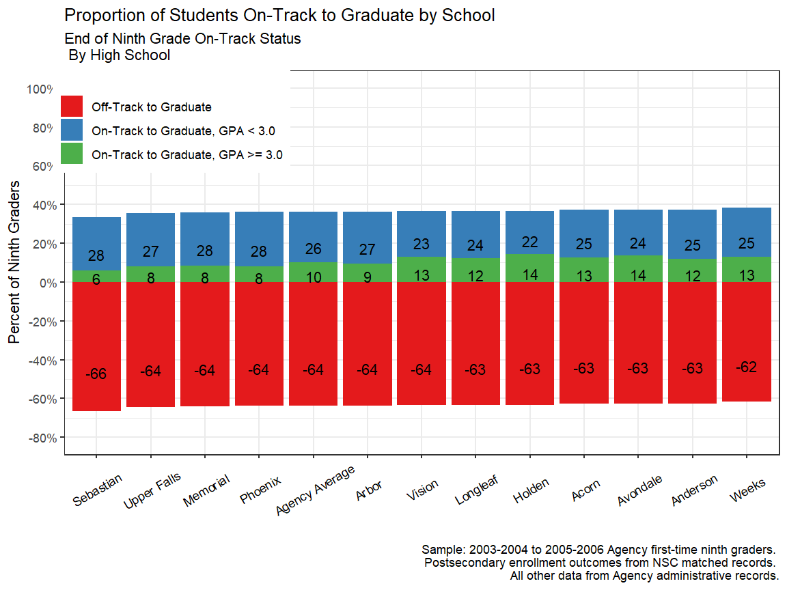
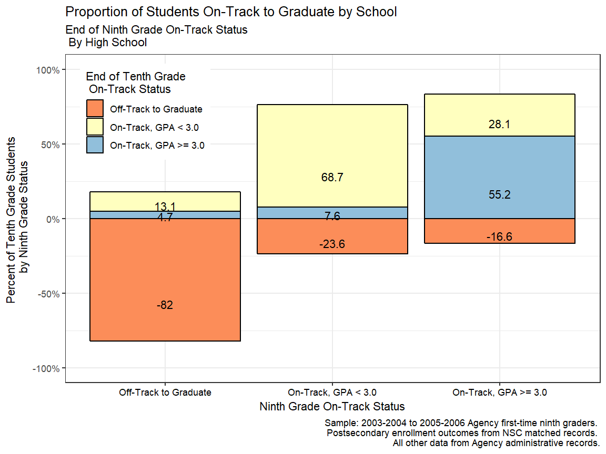

# On-Track in Ninth Grade
*College-Going Pathways*
*R Version*

## Getting Started


<div class="navbar navbar-default navbar-fixed-top" id="logo">
<div class="container">

</div>
</div>

### Objective
 
In this guide you will be able to visualize the share of students who are on track to
graduate on time after ninth grade by high school and by their on-track status after tenth
grade.

### Using this Guide

The College-Going Pathways series is a set of guides, code, and sample data about
policy-relevant college-going topics. Browse this and other guides in the series for 
ideas about ways to investigate student pathways through high school and 
college. Each guide includes several analyses in the form of charts together with Stata 
analysis and graphing code to generate each chart.

Once you’ve identified analyses that you want to try to replicate or modify, click the 
"Download" buttons to download Stata code and sample data. You can make changes to the 
charts using the code and sample data, or modify the code to work with your own data. If 
you're familiar with Github, you can click “Go to Repository” and clone the entire 
College-Going Pathways repository to your own computer. Go to the Participate page to read 
about more ways to engage with the OpenSDP community.

### About the Data

The data visualizations in the College-Going Pathways series use a synthetically 
generated college-going analysis sample data file which has one record per student. Each 
high school student is assigned to a ninth-grade cohort, and each student record includes 
demographic and program participation information, annual GPA and on-track status, high 
school graduation outcomes, and college enrollment information. The Connect guide (coming 
soon) will provide guidance and example code which will help you build a college-going 
analysis file using data from your own school system.


#### Loading the OpenSDP Dataset

This guide takes advantage of the OpenSDP synthetic dataset. 


```r
library(tidyverse) # main suite of R packages to ease data analysis
library(magrittr) # allows for some easier pipelines of data
library(tidyr) #
library(ggplot2) # to plot
library(scales) # to format
library(grid)
library(gridExtra) # to plot
# Read in some R functions that are convenience wrappers
source("../R/functions.R")
pkgTest("devtools")
pkgTest("OpenSDPsynthR")
```


### About the Analyses

Research suggests that academic performance in ninth grade strongly predicts 
the likelihood of a student dropping out of high school. In this section, you 
examine patterns of student retention and on-time transitions from ninth to 
tenth grade. This information can provide an early warning to an agency with 
students at-risk of dropping out, and might benefit from targeted support early 
in their high school careers.

### Sample Restrictions
One of the most important decisions in running each analysis is 
defining the sample. Each analysis corresponds to a different part of the education 
pipeline and as a result requires different cohorts of students.

If you are using the synthetic data we have provided, the sample restrictions have been 
predefined and are included below. If you run this code using your own agency data, 
change the sample restrictions based on your data. Note that you will have to run these 
sample restrictions at the beginning of your do file so they will feed into the rest of 
your code.


```r
# Read in global variables for sample restriction
# Agency name
agency_name <- "Agency"

# Ninth grade cohorts you can o☺bserve persisting to the second year of college
chrt_ninth_begin_persist_yr2 = 2004
chrt_ninth_end_persist_yr2 = 2006

# Ninth grade cohorts you can observe graduating high school on time
chrt_ninth_begin_grad = 2004
chrt_ninth_end_grad = 2006

# Ninth grade cohorts you can observe graduating high school one year late
chrt_ninth_begin_grad_late = 2004
chrt_ninth_end_grad_late = 2006

# High school graduation cohorts you can observe enrolling in college the fall after graduation
chrt_grad_begin = 2008
chrt_grad_end = 2010

# High school graduation cohorts you can observe enrolling in college two years after hs graduation
chrt_grad_begin_delayed = 2008
chrt_grad_end_delayed = 2010

# In RStudio these variables will appear in the Environment pane under "Values"
```

Based on the sample data, you will have three cohorts (sometimes only 
two) for analysis. If you are using your own agency data, you may decide 
to aggregate results for more or fewer cohorts to report your results. This 
decision depends on 1) how much historical data you have available and 
2) what balance to strike between reliability and averaging
away information on recent trends. We suggest you average results for the last 
three cohorts to take advantage of larger sample sizes and improve reliability. 
However, if you have data for more than three cohorts, you may decide to not 
average data out for fear of losing information about trends and recent changes 
in your agency.

### Giving Feedback on this Guide
 
This guide is an open-source document hosted on Github and generated using the Stata
Webdoc package. We welcome feedback, corrections, additions, and updates. Please
visit the OpenSDP college-going pathways repository to read our contributor guidelines.


## Analyses

### Proportion of Students On-Track by High School

**Purpose:** This analysis illustrates what percent of students are on-track 
after ninth grade graduate from each high school and the agency as a whole. 
Different levels of on-track for graduation are distinguished by high school.


**Required Analysis File Variables:**

- `sid`
- `chrt_ninth`
- `first_hs-Name`
- `first_hs_code`
- `ontrack_endyr1*`
- `cum_gpa_yr1`

**Analysis-Specific Sample Restrictions:** Keep students in ninth grade cohorts 
you can observe graduating high school on time AND are part of the on-track 
sample (attended the first semester of ninth grade and never transferred into 
or out of the system).

**Ask Yourself**

- How does the percent of students on-track differ by high school (consider 
the overall height of each bar)?
- How does the percent of students on-track for an advanced versus general 
diploma differ by high school (consider the different components of each bar)?

**Possible Next Steps or Action Plans:** Overall school-level results can be 
disaggregated by student subgroups of interest, (race, FRPL status, and eighth 
grade academic achievement). 

**Analytic Technique:** Calculate the proportion of students on-track at each 
school, and across the agency.


```r
# Step 1: Keep students in ninth grade cohorts you can observe graduating 
# high school on time AND are part of the ontrack sample (attended the first 
# semester of ninth grade and never transferred into or out of the system)

plotdf <- filter(cgdata, chrt_ninth >= chrt_ninth_begin_grad & 
                   chrt_ninth <= chrt_ninth_end_grad) %>% 
  filter(ontrack_sample == 1) %>% 
  mutate(ontrack_endyr1 = as.numeric(ontrack_endyr1) - 1, 
         ontrack_endyr2 = as.numeric(ontrack_endyr2) - 1)

# Step 2: Create variables for the outcomes "regular diploma recipients", 
#           "seamless transitioners" and "second year persisters"
plotdf$grad <- ifelse(!is.na(plotdf$chrt_grad) & plotdf$ontime_grad ==1, 1, 0)
plotdf$seamless_transitioners_any <- as.numeric(plotdf$enrl_1oct_ninth_yr1_any == 1 &
                                                 plotdf$ontime_grad == 1)
plotdf$second_year_persisters = as.numeric(plotdf$enrl_1oct_ninth_yr1_any == 1 &
                                             plotdf$enrl_1oct_ninth_yr2_any == 1 &
                                             plotdf$ontime_grad == 1)

# Step 3: Generate on track indicators that take into account students’ GPAs 
# upon completion of their first year in high school

plotdf$ot <- NA
plotdf$ot[plotdf$ontrack_endyr1 == 0] <- "Off-Track to Graduate"
plotdf$ot[plotdf$ontrack_endyr1 == 1 & plotdf$cum_gpa_yr1 < 3 &
            !is.na(plotdf$cum_gpa_yr1)] <- "On-Track to Graduate, GPA < 3.0"
plotdf$ot[plotdf$ontrack_endyr1 == 1 & plotdf$cum_gpa_yr1 >= 3 &
            !is.na(plotdf$cum_gpa_yr1)] <- "On-Track to Graduate, GPA >= 3.0"
```


```r
# Step 4: Obtain the agency average for the key variables
# and obtain mean rates for each school and append the agency average

progressBars <- bind_rows(
  plotdf %>% group_by(ot) %>% tally() %>% ungroup %>% 
    mutate(count = sum(n), first_hs_name = "Agency Average"), 
  plotdf %>% group_by(first_hs_name, ot) %>% tally() %>% ungroup %>% 
    group_by(first_hs_name) %>%
    mutate(count = sum(n))
)

# replace first_hs_name = subinstr(first_hs_name, " High School", "", .)
progressBars$first_hs_name <- gsub(" High School", "", progressBars$first_hs_name)

# Step 5: For students who are off-track upon completion of their first year 
#  of high school, convert the values to be negative for ease of 
#  visualization in the graph

progressBars$n[progressBars$ot == "Off-Track to Graduate"] <- 
  -progressBars$n[progressBars$ot == "Off-Track to Graduate"] 
# Figure caption
figureCaption <- paste0("Sample: ", chrt_ninth_begin_grad -1, "-", chrt_ninth_begin_grad, 
                        " to ", chrt_ninth_end_grad -1, "-", chrt_ninth_end_grad, 
                        " ", agency_name, " first-time ninth graders. \n", 
                        "Postsecondary enrollment outcomes from NSC matched records. \n",
                        "All other data from ", agency_name, " administrative records.")
```


```r
# Step 6: Plot
ggplot(progressBars, aes(x = reorder(first_hs_name, n/count), 
                         y = n/count, group = ot)) + 
  geom_bar(aes(fill = ot), stat = 'identity') + 
  geom_text(aes(label = round(100* n/count, 0)), 
            position = position_stack(vjust=0.3)) + 
  theme_bw() + 
  scale_y_continuous(limits = c(-0.8,1), label = percent, 
                    name = "Percent of Ninth Graders", 
                    breaks = seq(-0.8, 1, 0.2)) + 
  scale_fill_brewer(name = "", type = "qual", palette = 6) + 
  theme(axis.text.x = element_text(angle = 30, color = "black", vjust = 0.5), 
        legend.position = c(0.15, 0.875)) +
  labs(title = "Proportion of Students On-Track to Graduate by School", 
       subtitle = "End of Ninth Grade On-Track Status \n By High School", x = "",
       caption = figureCaption)
```



### Ninth To Tenth Grade Transition by On-Track Status

**Purpose:** This analysis explores how on-track status after ninth grade 
(the horizontal axis) predicts ontrack status in tenth grade (the vertical axis). 
This analysis is useful for developing early dropout warning indicators for 
at-risk students as early as the second semester of ninth grade. 

**Required Analysis File Variables:**

- `sid`
- `chrt_ninth`
- `first_hs_name`
- `first_hs_code`
- `ontrack_endyr1*`
- `cum_gpa_yr1*`

**Analysis-Specific Sample Restrictions:** Keep students in ninth grade cohorts 
you can observe graduating high school on time AND are part of the on-track 
sample (attended the first semester of ninth grade and never transferred into 
or out of the system).

**Ask Yourself:**

- What percent of those in a specific on-track category at the end of ninth 
grade stay in that same on-track category? For example, what percent of 
off-track ninth graders continue off-track in tenth grade?
- How might you use an early warning system to help students get back on-track 
for graduation?

**Possible Next Steps or Action Plans:** Identify additional risk factors, 
(chronic absenteeism, prior academic achievement etc.) which can be 
incorporated into analyses like the one above. This could be used to further 
understand which students struggle, why they struggle, and interventions to keep 
them enrolled and engaged.


```r
# Step 1: Keep students in ninth grade cohorts you can observe graduating 
# high school on time AND are part of the ontrack sample (attended the first 
# semester of ninth grade and never transferred into or out of the system)

plotdf <- filter(cgdata, chrt_ninth >= chrt_ninth_begin_grad & 
                   chrt_ninth <= chrt_ninth_end_grad) %>% 
   filter(ontrack_sample == 1) %>% 
  mutate(ontrack_endyr1 = as.numeric(ontrack_endyr1) -1,
         ontrack_endyr2 = as.numeric(ontrack_endyr2) -1)

# Step 2: Create variables for the outcomes "regular diploma recipients", 
#  "seamless transitioners" and "second year persisters"

plotdf$grad <- ifelse(!is.na(plotdf$chrt_grad) & plotdf$ontime_grad ==1, 1, 0)
plotdf$seamless_transitioners_any <- as.numeric(plotdf$enrl_1oct_ninth_yr1_any == 1 &
                                                 plotdf$ontime_grad == 1)
plotdf$second_year_persisters = as.numeric(plotdf$enrl_1oct_ninth_yr1_any == 1 &
                                             plotdf$enrl_1oct_ninth_yr2_any == 1 &
                                             plotdf$ontime_grad == 1)

# Step 3: Generate on track indicators that take into account students’ GPAs 
# upon completion of their first year in high school

plotdf$ot <- NA
plotdf$ot[plotdf$ontrack_endyr1 == 0] <- "Off-Track to Graduate"
plotdf$ot[plotdf$ontrack_endyr1 == 1 & plotdf$cum_gpa_yr1 < 3 &
            !is.na(plotdf$cum_gpa_yr1)] <- "On-Track, GPA < 3.0"
plotdf$ot[plotdf$ontrack_endyr1 == 1 & plotdf$cum_gpa_yr1 >= 3 &
            !is.na(plotdf$cum_gpa_yr1)] <- "On-Track, GPA >= 3.0"

# Step 4: Create indicators for students upon completion of their second 
#  year of high school

plotdf$ot_10 <- NA
plotdf$ot_10[plotdf$ontrack_endyr2 == 0] <- "Off-Track to Graduate"
plotdf$ot_10[plotdf$ontrack_endyr2 == 1 & plotdf$cum_gpa_yr2 < 3 &
               !is.na(plotdf$cum_gpa_yr2)] <- "On-Track, GPA < 3.0"
plotdf$ot_10[plotdf$ontrack_endyr2 == 1 & plotdf$cum_gpa_yr2 >= 3 &
               !is.na(plotdf$cum_gpa_yr2)] <- "On-Track, GPA >= 3.0"
plotdf$ot_10[plotdf$status_after_yr2 == 3 | plotdf$status_after_yr2 == 4] <-
  "Dropout/Disappear"
```


```r
# Step 5: Obtain mean rates for each school and append the agency average
onTrackBar <- plotdf %>% group_by(ot, ot_10) %>% 
  select(ot) %>% tally() %>% 
  ungroup %>% group_by(ot) %>%
  mutate(count = sum(n))


# Step 6: For students who are off-track upon completion of their first year 
#  of high school, convert the values to be negative for ease of visualization 
#  in the graph

onTrackBar <- na.omit(onTrackBar) # drop missing
onTrackBar$n[onTrackBar$ot_10 == "Off-Track to Graduate"] <- 
  -onTrackBar$n[onTrackBar$ot_10 == "Off-Track to Graduate"] 
onTrackBar$n[onTrackBar$ot_10 == "Dropout/Disappear"] <- 
  -onTrackBar$n[onTrackBar$ot_10 == "Dropout/Disappear"] 
```


```r
ggplot(onTrackBar, aes(x = reorder(ot, n/count), 
                         y = n/count, group = ot_10)) + 
  geom_bar(aes(fill = ot_10), stat = 'identity', color = I("black")) + 
  geom_text(aes(label = round(100* n/count, 1)), 
            position = position_stack(vjust=0.3)) + 
  theme_bw() + 
  scale_y_continuous(limits = c(-1, 1), label = percent, 
      name = "Percent of Tenth Grade Students \n by Ninth Grade Status") + 
  scale_fill_brewer(name = "End of Tenth Grade \n On-Track Status", 
                    type = "div", palette = 7) + 
  theme(axis.text.x = element_text(color = "black"), 
        legend.position = c(0.15, 0.825)) +
  labs(title = "Proportion of Students On-Track to Graduate by School", 
       x = "Ninth Grade On-Track Status",
       subtitle = "End of Ninth Grade On-Track Status \n By High School", 
       caption = figureCaption)
```



#### *This guide was originally created by the Strategic Data Project.*
