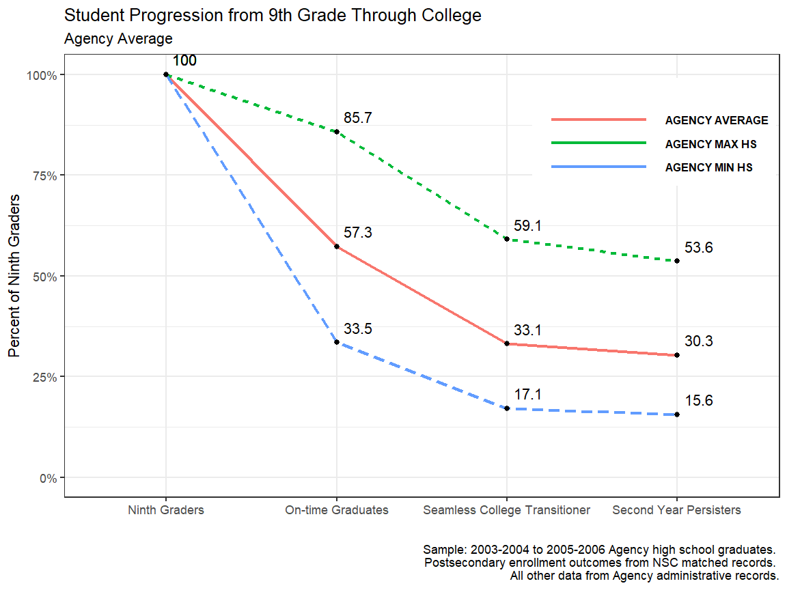
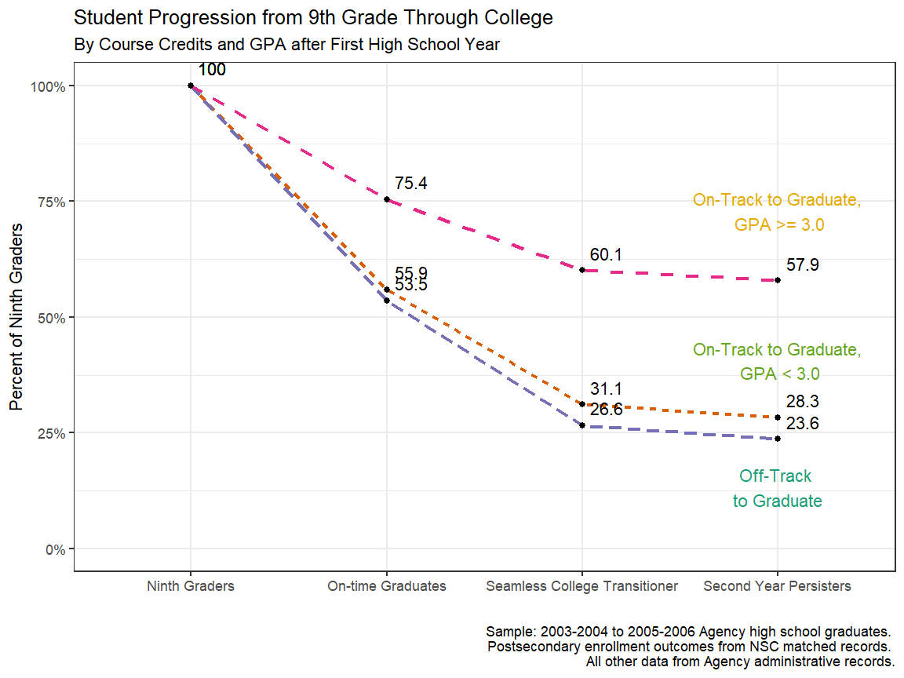

Jared Knowles, Lauren Dahlin  
April 7, 2017  


# College-Going Pipeline
*College-Going Pathways*
*R Version*

## Getting Started 


<div class="navbar navbar-default navbar-fixed-top" id="logo">
<div class="container">

</div>
</div>

### Objective
 
In this guide you will be able to visualize the progress of students and student
subgroups through important milestones from ninth grade through the second year of college

### Using this Guide

The College-Going Pathways series is a set of guides, code, and sample data about
policy-relevant college-going topics. Browse this and other guides in the series for 
ideas about ways to investigate student pathways through high school and 
college. Each guide includes several analyses in the form of charts together with Stata 
analysis and graphing code to generate each chart.

Once you’ve identified analyses that you want to try to replicate or modify, click the 
"Download" buttons to download Stata code and sample data. You can make changes to the 
charts using the code and sample data, or modify the code to work with your own data. If 
you're familiar with Github, you can click “Go to Repository” and clone the entire 
College-Going Pathways repository to your own computer. Go to the [Participate](https://strategicdataproject.github.io/opensdp/participate/) page to read 
about more ways to engage with the OpenSDP community.

### About the Data

The data visualizations in the College-Going Pathways series use a synthetically 
generated college-going analysis sample data file which has one record per student. Each 
high school student is assigned to a ninth-grade cohort, and each student record includes 
demographic and program participation information, annual GPA and on-track status, high 
school graduation outcomes, and college enrollment information. The Connect guide (coming 
soon) will provide guidance and example code which will help you build a college-going 
analysis file using data from your own school system.

#### Loading the OpenSDP Dataset

This guide takes advantage of the OpenSDP synthetic dataset. 


```r
library(tidyverse) # main suite of R packages to ease data analysis
library(magrittr) # allows for some easier pipelines of data
library(tidyr) #
library(ggplot2) # to plot
library(scales) # to format
library(grid)
library(gridExtra) # to plot
# Read in some R functions that are convenience wrappers
source("../R/functions.R")
pkgTest("devtools")
pkgTest("OpenSDPsynthR")
```


### About the Analyses

The analyses in this guide summarize student attainment 
from ninth grade through college using three milestones: 1) on-time high school
completion, 2) seamless college transition, and 3) persistence to the second 
year of college. 

Through these analyses, you identify drop-offs along the education pipeline for 
students as a group and as subgroups. For different subgroups, these analyses 
illuminate disparities in college attainment by race, family income, high school
attended, and academic achievement. A steep decline in college enrollment from 
high school completion date for specific subgroups may indicate barriers to 
college access. On the other hand, a steep decline from initial college 
enrollment to second-year persistence might suggest students were not prepared 
for rigorous college coursework during high school. 

### Analysis-Specific Sample Restrictions

One of the most important decisions in running each analysis is 
defining the sample. Each analysis corresponds to a different part of the education 
pipeline and as a result requires different cohorts of students.

If you are using the synthetic data we have provided, the sample restrictions have been 
predefined and are included below. If you run this code using your own agency data, 
change the sample restrictions based on your data. Note that you will have to run these 
sample restrictions at the beginning of your do file so they will feed into the rest of 
your code.


```r
# Read in global variables for sample restriction
# Agency name
agency_name <- "Agency"

# Ninth grade cohorts you can observe persisting to the second year of college
chrt_ninth_begin_persist_yr2 = 2004
chrt_ninth_end_persist_yr2 = 2006

# Ninth grade cohorts you can observe graduating high school on time
chrt_ninth_begin_grad = 2004
chrt_ninth_end_grad = 2006

# Ninth grade cohorts you can observe graduating high school one year late
chrt_ninth_begin_grad_late = 2004
chrt_ninth_end_grad_late = 2006

# High school graduation cohorts you can observe enrolling in college the fall after graduation
chrt_grad_begin = 2008
chrt_grad_end = 2010

# High school graduation cohorts you can observe enrolling in college two years after hs graduation
chrt_grad_begin_delayed = 2008
chrt_grad_end_delayed = 2010

# In RStudio these variables will appear in the Environment pane under "Values"
```

Based on the sample data, you will have three cohorts (sometimes only 
two) for analysis. If you are using your own agency data, you may decide 
to aggregate results for more or fewer cohorts to report your results. This 
decision depends on 1) how much historical data you have available and 
2) what balance to strike between reliability and averaging
away information on recent trends. We suggest you average results for the last 
three cohorts to take advantage of larger sample sizes and improve reliability. 
However, if you have data for more than three cohorts, you may decide to not 
average data out for fear of losing information about trends and recent changes 
in your agency.

### Giving Feedback on this Guide
 
This guide is an open-source document hosted on Github and generated using the Stata
Webdoc package. We welcome feedback, corrections, additions, and updates. Please
visit the OpenSDP college-going pathways repository to read our contributor guidelines.

## Analyses

### Overall Progression

**Purpose:** This analysis tracks the overall percent of ninth graders who 
complete high school on-time, seamlessly enroll in college, and persist to the 
second year of college. To examine the range of attainment at each milestone, 
the minimum and maximum values of any high school are shown. 

**Required Analysis File Variables:**

- `sid`
- `chrt_ninth`
- `first_hs_name`
- `ontime_grad`
- `enrl_1oct_ninth_yr1_any`
- `enrl_1oct_ninth_yr2_any`

**Analysis-Specific Sample Restrictions:** Keep students in ninth
grade cohorts for which persistence to the second year of college
can be reported.

**Ask Yourself** 

- Do you notice drop-offs along the pipeline?
- Are differences in agency maxima and minima at different points along the 
pipeline surprising? What might be different about these high schools?
- Are your numbers in line with agency-reported figures in other publicly 
available reports? What might account for differences?

**Analytic Technique:** Calculate the proportion of first-time ninth graders that 
progress to each step along the education pipeline.


```r
# Step 1: Keep students in ninth grade cohorts you can observe persisting to the 
# second year of college

plotdf <- filter(cgdata, chrt_ninth >= chrt_ninth_begin_persist_yr2 & 
                   chrt_ninth <= chrt_ninth_end_persist_yr2)


# Step 4: Create variables for the outcomes "regular diploma recipients", 
#  "seamless transitioners" and "second year persisters"

plotdf$grad <- ifelse(!is.na(plotdf$chrt_grad) & plotdf$ontime_grad ==1, 1, 0)
plotdf$seamless_transitioners_any <- as.numeric(plotdf$enrl_1oct_ninth_yr1_any == 1 &
                                                 plotdf$ontime_grad == 1)
plotdf$second_year_persisters = as.numeric(plotdf$enrl_1oct_ninth_yr1_any == 1 &
                                             plotdf$enrl_1oct_ninth_yr2_any == 1 &
                                             plotdf$ontime_grad == 1)
# Step 4: Create agency-level average outcomes

# 2. Calculate the mean of each outcome variable by agency

agencyData <- plotdf %>%  
  summarize(grad = mean(grad), 
            seamless_transitioners_any = mean(seamless_transitioners_any, na.rm=TRUE), 
            second_year_persisters = mean(second_year_persisters, na.rm=TRUE), 
            N = n())

agencyData$school_name <- "AGENCY AVERAGE"
# 2. Calculate the mean of each outcome variable by first high school attended
schoolData <- plotdf %>% group_by(first_hs_name) %>% 
  summarize(grad = mean(grad), 
            seamless_transitioners_any = mean(seamless_transitioners_any,
                                               na.rm=TRUE), 
            second_year_persisters = mean(second_year_persisters, na.rm=TRUE), 
            N = n())
# 1. Create a variable school_name that takes on the value of students’ first 
## high school attended
names(schoolData)[1] <- "school_name"

# 3. Identify the agency maximum values for each of the three outcome variables
maxSchool <- schoolData %>% summarize_all(.funs = funs("max"))
maxSchool$school_name <- "AGENCY MAX HS"

# 4. Identify the agency minimum values for each of the three outcome variables
minSchool <- schoolData %>% summarize_all(.funs = funs("min"))
minSchool$school_name <- "AGENCY MIN HS"
# 5. Append the three tempfiles to the school-level file loaded into R
schoolData <- bind_rows(schoolData, agencyData, 
                        minSchool, maxSchool)
rm(agencyData, minSchool, maxSchool)
```


```r
# Step 6: Prepare to graph the results
schoolData$cohort <- 1
schoolData <- schoolData %>% gather(key = outcome, 
                             value = measure, -N, -school_name)
schoolData$subset <- grepl("AGENCY", schoolData$school_name)

schoolData$outcome[schoolData$outcome == "cohort"] <- "Ninth Graders"
schoolData$outcome[schoolData$outcome == "grad"] <- "On-time Graduates"
schoolData$outcome[schoolData$outcome == "seamless_transitioners_any"] <- 
  "Seamless College Transitioner"
schoolData$outcome[schoolData$outcome == "second_year_persisters"] <- 
  "Second Year Persisters"
# Figure caption
figureCaption <- paste0("Sample: ", chrt_ninth_begin_persist_yr2-1, "-", 
                        chrt_ninth_begin_persist_yr2, " to ", 
                        chrt_ninth_end_persist_yr2-1, "-", chrt_ninth_end_persist_yr2, " ", 
                        agency_name, " high school graduates. \n", 
                        "Postsecondary enrollment outcomes from NSC matched records. \n", 
                        "All other data from ", agency_name, " administrative records.")
```


```r
## Step 7: Graph the results

ggplot(schoolData[schoolData$subset,], 
       aes(x = outcome, y = measure, group = school_name, 
           color = school_name, linetype = school_name)) + 
  geom_line(size = 1.1) + geom_point(aes(group = 1), color = I("black")) +
  geom_text(aes(label = round(measure * 100, 1)), vjust = -0.8, hjust = -0.25, 
            color = I("black")) +
  scale_y_continuous(limits = c(0, 1), label = percent) + 
  theme_bw() + theme(legend.position = c(0.825, 0.825)) + 
  guides(color = guide_legend("", keywidth = 6, 
                              label.theme = element_text(face = "bold", 
                                                         size = 8,
                                                         angle = 0)), 
         linetype = "none") +
  labs(y = "Percent of Ninth Graders", 
       title = "Student Progression from 9th Grade Through College", 
       subtitle = "Agency Average", x = "",
       caption = figureCaption)
```



### Progression by Student Race/Ethnicity

**Purpose:** This analysis tracks the percent of ninth graders of 
different races/ethnicities who complete high school on-time, seamlessly enroll 
in college, and persist to the second year of college.

**Required Analysis File Variables:**

- `sid`
- `race_ethnicity`
- `chrt_ninth`
- `ontime_grad`
- `enrl_1oct_ninth_yr1_any`
- `enrl_1oct_ninth_yr2_any`


**Analysis-Specific Sample Restrictions:** 

- Keep students in ninth grade cohorts for which persistence
to the second year of college can be reported.
- Restrict the sample to include students from the most representative
racial/ethnic sub-groups.

**Ask Yourself** 

- Which races/ethnicities face larger drop-offs along the pipeline?
- Might certain groups face different barriers to progressing along the education pipeline?

**Analytic Technique:** Calculate the proportion of first-time ninth graders 
that progress to each step along the education pipeline.


```r
# Step 1: Keep students in ninth grade cohorts you can observe persisting to 
## the second year of college

plotdf <- filter(cgdata, chrt_ninth >= chrt_ninth_begin_persist_yr2 & 
                   chrt_ninth <= chrt_ninth_end_persist_yr2)

# Step 2: Create variables for the outcomes "regular diploma recipients", 
## "seamless transitioners" and "second year persisters"
plotdf$grad <- ifelse(!is.na(plotdf$chrt_grad) & plotdf$ontime_grad ==1, 1, 0)
plotdf$seamless_transitioners_any <- as.numeric(plotdf$enrl_1oct_ninth_yr1_any == 1 &
                                                 plotdf$ontime_grad == 1)
plotdf$second_year_persisters = as.numeric(plotdf$enrl_1oct_ninth_yr1_any == 1 &
                                             plotdf$enrl_1oct_ninth_yr2_any == 1 &
                                             plotdf$ontime_grad == 1)
# Step 3: Create agency-level average outcomes
progressRace <- plotdf %>% group_by(race_ethnicity) %>% 
  summarize(grad = mean(grad), 
            seamless_transitioners_any = mean(seamless_transitioners_any, na.rm=TRUE), 
            second_year_persisters = mean(second_year_persisters, na.rm=TRUE), 
            N = n())
```


```r
# Step 4: Reformat the data for plotting
progressRace$cohort <- 1
progressRace <- progressRace %>% gather(key = outcome, 
                             value = measure, -N, -race_ethnicity)

# Step 5: Recode variables for plot-friendly labels
progressRace$outcome[progressRace$outcome == "cohort"] <- "Ninth Graders"
progressRace$outcome[progressRace$outcome == "grad"] <- "On-time Graduates"
progressRace$outcome[progressRace$outcome == "seamless_transitioners_any"] <- 
  "Seamless College Transitioner"
progressRace$outcome[progressRace$outcome == "second_year_persisters"] <- 
  "Second Year Persisters"

progressRace$subset <- ifelse(as.numeric(progressRace$race_ethnicity) %in% c(1, 3, 2, 5), 
                              TRUE, FALSE)
progressRace$race_ethnicity[progressRace$race_ethnicity == 1] <- "Black"
progressRace$race_ethnicity[progressRace$race_ethnicity == 2] <- "Asian"
progressRace$race_ethnicity[progressRace$race_ethnicity == 3] <- "Hispanic"
progressRace$race_ethnicity[progressRace$race_ethnicity == 4] <- "Native American"
progressRace$race_ethnicity[progressRace$race_ethnicity == 5] <- "White"
progressRace$race_ethnicity[progressRace$race_ethnicity == 6] <- "Multiple/Other"
```


```r
# Step 6: Graph the results
ggplot(progressRace[progressRace$subset,], 
       aes(x = outcome, y = measure, group = race_ethnicity, 
           color = race_ethnicity, linetype = race_ethnicity)) + 
  geom_line(size = 1.1) + geom_point(aes(group = 1), color = I("black")) +
  geom_text(aes(label = round(measure * 100, 1)), vjust = -0.8, hjust = -0.25, 
            color = I("black")) +
  scale_y_continuous(limits = c(0, 1), label = percent) + 
  theme_bw() + theme(legend.position = c(0.825, 0.825)) + 
  guides(color = guide_legend("", keywidth = 6, 
                          label.theme = 
                            element_text(face = "bold", size = 8,
                                         angle = 0)), linetype = "none") +
  labs(y = "Percent of Ninth Graders", 
       title = "Student Progression from 9th Grade Through College", 
       subtitle = "By Student Race/Ethnicity", x = "",
       caption = figureCaption)
```


### Progression by Student Race/Ethnicity, Among FRPL Students

**Purpose:**  This analysis tracks the percent of ninth graders of different
races/ethnicities who ever qualified for free or reduce price lunch who complete 
high school on-time, seamlessly enroll in college, and persist to the second 
year of college.

**Required Analysis File Variables:**

- `sid`
- `race_ethnicity`
- `frpl_ever`
- `chrt_ninth`
- `ontime_grad`
- `enrl_1oct_ninth_yr1_any`
- `enrl_1oct_ninth_yr2_any`

**Analysis-Specific Sample Restrictions:** 

- Keep students in ninth grade cohorts for which persistence to the second year 
of college can be reported. 
- Restrict the analysis to include only students who were ever eligible to 
receive free-or reduced-price lunch throughout their time in your agency, and 
drop any race/ethnic groups with less than 20 students at any point along the 
pipeline.

**Ask Yourself** 

- How do differences between races/ethnicities change along the pipeline when 
only students whoever qualifying for free or reduced price lunch are examined?

**Analytic Technique:** Calculate the proportion of first-time ninth graders 
that progress to each step along the education pipeline.


```r
## Step 1: Keep students in ninth grade cohorts you can observe persisting to 
## the second year of college AND are ever FRPL-eligible

plotdf <- filter(cgdata, chrt_ninth >= chrt_ninth_begin_persist_yr2 & 
                   chrt_ninth <= chrt_ninth_end_persist_yr2) %>% 
  filter(frpl_ever > 0)

# Step 2: Create variables for the outcomes "regular diploma recipients", 
## "seamless transitioners" and "second year persisters"

plotdf$grad <- ifelse(!is.na(plotdf$chrt_grad) & plotdf$ontime_grad == 1, 1, 0)
plotdf$seamless_transitioners_any <- ifelse(plotdf$enrl_1oct_ninth_yr1_any == 1 &
                                                 plotdf$ontime_grad == 1, 1, 0)
plotdf$second_year_persisters = ifelse(plotdf$enrl_1oct_ninth_yr1_any == 1 &
                                             plotdf$enrl_1oct_ninth_yr2_any == 1 &
                                             plotdf$ontime_grad == 1, 1, 0)

# Step 4: Create agency-level average outcomes
# Calculate the mean of each outcome variable by race/ethnicity

progressRaceFRL <- plotdf %>% group_by(race_ethnicity) %>% 
  summarize(grad = mean(grad), 
            seamless_transitioners_any = mean(seamless_transitioners_any, na.rm=TRUE), 
            second_year_persisters = mean(second_year_persisters, na.rm=TRUE), 
            N = n())

# Step 5: Reformat the data file so that one variable contains all the 
# outcomes of interest

progressRaceFRL %<>% filter(N >= 20)
```


```r
# Step 6: Prepare to graph the results
## Reshape the data 
progressRaceFRL$cohort <- 1
progressRaceFRL <- progressRaceFRL %>% gather(key = outcome, 
                             value = measure, -N, -race_ethnicity)

## Recode the variables for plot friendly labels

progressRaceFRL$outcome[progressRaceFRL$outcome == "cohort"] <- 
  "Ninth Graders"
progressRaceFRL$outcome[progressRaceFRL$outcome == "grad"] <- 
  "On-time Graduates"
progressRaceFRL$outcome[progressRaceFRL$outcome == "seamless_transitioners_any"] <-
  "Seamless College Transitioner"
progressRaceFRL$outcome[progressRaceFRL$outcome == "second_year_persisters"] <- 
  "Second Year Persisters"

progressRaceFRL$subset <- ifelse(as.numeric(progressRaceFRL$race_ethnicity) %in% c(1, 3, 5), 
                              TRUE, FALSE)
progressRaceFRL$race_ethnicity[progressRaceFRL$race_ethnicity == 1] <- "Black"
progressRaceFRL$race_ethnicity[progressRaceFRL$race_ethnicity == 2] <- "Asian"
progressRaceFRL$race_ethnicity[progressRaceFRL$race_ethnicity == 3] <- "Hispanic"
progressRaceFRL$race_ethnicity[progressRaceFRL$race_ethnicity == 4] <- "Native American"
progressRaceFRL$race_ethnicity[progressRaceFRL$race_ethnicity == 5] <- "White"
progressRaceFRL$race_ethnicity[progressRaceFRL$race_ethnicity == 6] <- "Multiple/Other"
```


```r
ggplot(progressRaceFRL[progressRaceFRL$subset,], 
       aes(x = outcome, y = measure, group = race_ethnicity, 
           color = race_ethnicity, linetype = race_ethnicity)) + 
  geom_line(size = 1.1) + geom_point(aes(group = 1), color = I("black")) +
  geom_text(aes(label = round(measure * 100, 1)), vjust = -0.8, hjust = -0.25, 
            color = I("black")) +
  scale_y_continuous(limits = c(0, 1), label = percent) + 
  theme_bw() + theme(legend.position = c(0.825, 0.825)) + 
  guides(color = guide_legend("", keywidth = 6, 
                              label.theme = element_text(face = "bold", 
                                                         size = 8,
                                                         angle = 0)), 
         linetype = "none") +
  labs(y = "Percent of Ninth Graders", 
       title = "Student Progression from 9th Grade Through College", 
       subtitle = paste0(c(
         "Among Students Qualifying for Free or Reduced Price Lunch \n", 
                           "By Student Race/Ethnicity")), 
       x = "",
       caption = figureCaption)
```


### Progression by Students' On-Track Status After Ninth Grade

**Purpose:** This analysis tracks the percent of ninth graders at different 
levels of being on-track for graduation who complete high school on-time, 
seamlessly enroll in college, and then persist to the second year of college.


**Required Analysis File Variables:**

- `sid`
- `chrt_ninth`
- `ontrack_sample`
- `ontrack_end_yr*`
- `cum_gpa_yr*`
- `ontime_grad`
- `enrl_1oct_ninth_yr1_any`
- `enrl_1oct_ninth_yr2_any`


**Analysis-Specific Sample Restrictions:** 

- Only include the three most recent ninth grade cohorts for
which persistence to second year of college can be reported.
- Restrict the sample to include only students in the on-track
analytic sample (students who attended the first semester of
ninth grade in the system and never transferred into, or out
of the system).
- Students that obtain Special Education diplomas upon high
school entry should be excluded from the analytic sample if
these students are not required to meet the same graduation
requirements as general education students, and if the
designation can be made.


**Ask Yourself** 

- How does being on-track for graduation after ninth grade relate to on-time 
graduation, seamless enrollment, and second year persistence?
- How does being on-track after ninth grade with a higher GPA compare to being 
on-track with a lower GPA?


**Analytic Technique:** Calculate the proportion of first-time ninth graders 
that progressed along the education pipeline.


```r
#  // Step 1: Keep students in ninth grade cohorts you can observe persisting 
#  to the second year of college AND are included in the on-track analysis sample

plotdf <- filter(cgdata, chrt_ninth >= chrt_ninth_begin_persist_yr2 & 
                   chrt_ninth <= chrt_ninth_end_persist_yr2) %>% 
  filter(ontrack_sample == 1) %>% 
  mutate(ontrack_endyr1 = as.numeric(ontrack_endyr1) -1)

# // Step 2: Create variables for the outcomes "regular diploma recipients", 
# "seamless transitioners" and "second year persisters"

plotdf$grad <- ifelse(!is.na(plotdf$chrt_grad) & plotdf$ontime_grad ==1, 1, 0)
plotdf$seamless_transitioners_any <- as.numeric(plotdf$enrl_1oct_ninth_yr1_any == 1 &
                                                 plotdf$ontime_grad == 1)
plotdf$second_year_persisters = as.numeric(plotdf$enrl_1oct_ninth_yr1_any == 1 &
                                             plotdf$enrl_1oct_ninth_yr2_any == 1 &
                                             plotdf$ontime_grad == 1)

# // Step 3: Generate on track indicators that take into account students’ GPAs 
# upon completion of their first year in high school
# TODO: Check for NA values in how ontrack_endyr is coded
plotdf$ot <- NA
plotdf$ot[plotdf$ontrack_endyr1 == 0] <- "Off-Track to Graduate"

# Check for correctness
plotdf$ot[plotdf$ontrack_endyr1 == 1 & plotdf$cum_gpa_yr1 < 3 & 
            !is.na(plotdf$cum_gpa_yr1)] <- "On-Track to Graduate, GPA < 3.0"
plotdf$ot[plotdf$ontrack_endyr1 == 1 & plotdf$cum_gpa_yr1 >= 3 & 
            !is.na(plotdf$cum_gpa_yr1)] <- "On-Track to Graduate, GPA >= 3.0"
```


```r
#  // Step 4: Calculate aggregates for the Agency by on track status

progressTrack <- plotdf %>% group_by(ot) %>% 
  summarize(grad = mean(grad), 
            seamless_transitioners_any = mean(seamless_transitioners_any, na.rm=TRUE), 
            second_year_persisters = mean(second_year_persisters, na.rm=TRUE), 
            N = n())

# // Step 5: Reformat the data file so that one variable contains all the outcomes 
#  of interest
progressTrack$cohort <- 1
progressTrack <- progressTrack %>% gather(key = outcome, 
                             value = measure, -N, -ot)

progressTrack$outcome[progressTrack$outcome == "cohort"] <- "Ninth Graders"
progressTrack$outcome[progressTrack$outcome == "grad"] <- "On-time Graduates"
progressTrack$outcome[progressTrack$outcome == "seamless_transitioners_any"] <-
  "Seamless College Transitioner"
progressTrack$outcome[progressTrack$outcome == "second_year_persisters"] <- 
  "Second Year Persisters"
```


```r
# Annotate for direct labels, find endpoints
annotation_pos <- c(progressTrack$measure[progressTrack$outcome == "Second Year Persisters" & 
                                        progressTrack$ot == "Off-Track to Graduate"] - 0.25, 
                    progressTrack$measure[progressTrack$outcome == "Second Year Persisters" & 
                                 progressTrack$ot == "On-Track to Graduate, GPA < 3.0"] + 0.07,
                    progressTrack$measure[progressTrack$outcome == "Second Year Persisters" & 
                                     progressTrack$ot == "On-Track to Graduate, GPA >= 3.0"]+0.05)

ann_txt <- data.frame(outcome = rep("Second Year Persisters", 3), 
                      measure = annotation_pos + 0.1,
                      textlabel = c("Off-Track \nto Graduate", 
                                    "On-Track to Graduate,\n GPA < 3.0", 
                                    "On-Track to Graduate,\n GPA >= 3.0"))
ann_txt$ot <- ann_txt$textlabel

ggplot(progressTrack, 
       aes(x = outcome, y = measure, group = ot, 
           color = ot, linetype = ot)) + 
  geom_line(size = 1.1) + geom_point(aes(group = 1), color = I("black")) +
  geom_text(aes(label = round(measure * 100, 1)), vjust = -0.8, hjust = -0.25, 
            color = I("black")) +
  geom_text(data = ann_txt, aes(label = textlabel)) + 
  scale_y_continuous(limits = c(0, 1), label = percent) + 
  theme_bw() + theme(legend.position = c(0.825, 0.825)) + 
  scale_color_brewer(type = "qual", palette = 2) +
  guides(color = "none", 
         linetype = "none") +
  labs(y = "Percent of Ninth Graders", 
       title = "Student Progression from 9th Grade Through College", 
       subtitle = "By Course Credits and GPA after First High School Year", x = "",
       caption = figureCaption)
```



#### *This guide was originally created by the Strategic Data Project.*
